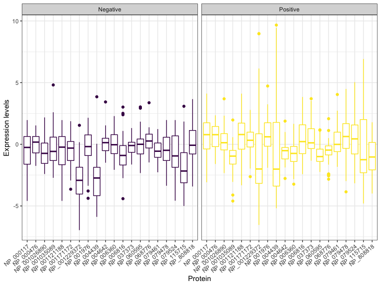
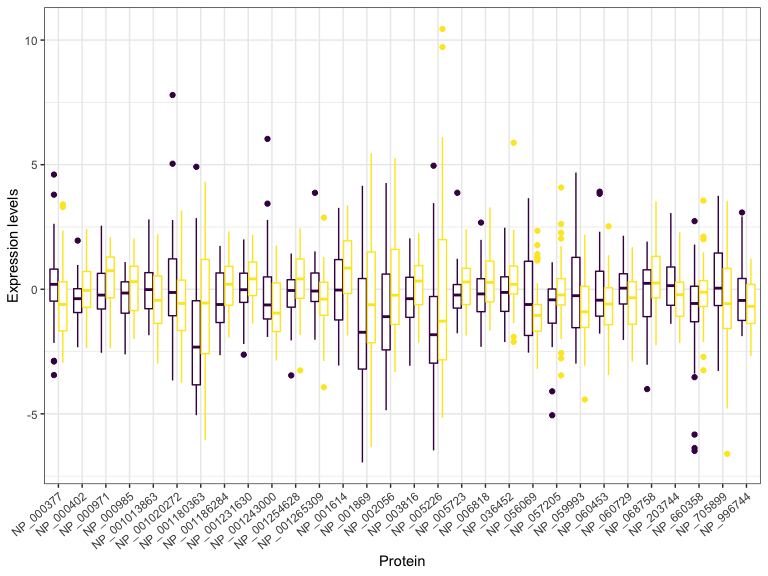
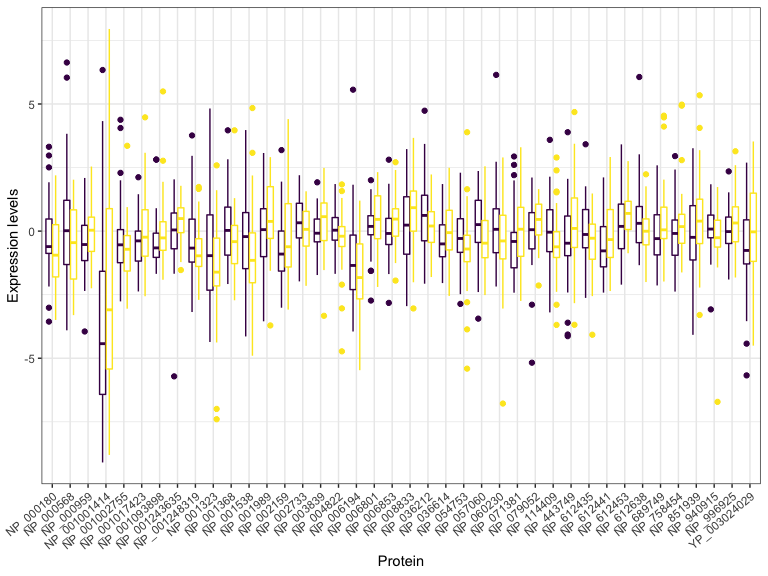
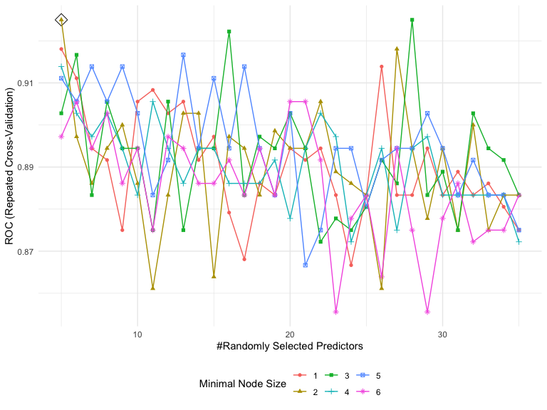
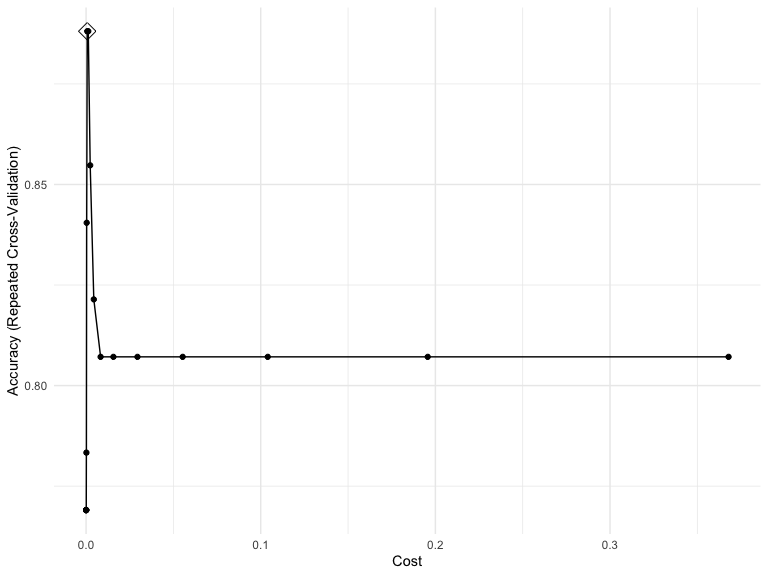
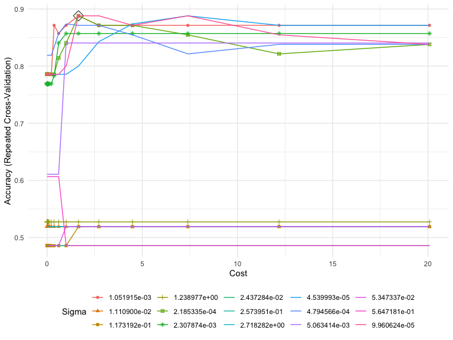

Breast Cancer Type Prediction using Proteomic Data
================
Ngoc Duong - nqd2000
05/15/2020

# Data cleaning

**Import data and get rid of NA values**

``` r
#import data
outcome = read.csv("./breastcancerproteomes/clinical_data_breast_cancer.csv") %>% janitor::clean_names()
proteome = read.csv("./breastcancerproteomes/77_cancer_proteomes_CPTAC_itraq.csv") 

#clean proteome data
#transpose dataset
proteome_tp <- transpose(proteome)

#get row and colnames in order
colnames(proteome_tp) <- proteome$RefSeq_accession_number
proteome_tp$par_id <- colnames(proteome) 

#rearrange data
proteome_with_id = as_tibble(proteome_tp) %>% select(par_id, everything()) %>% .[-c(1:3),] %>% separate(par_id, c("id2","id4","tcga")) %>% select(-tcga)

proteome_wo_id = as_tibble(proteome_tp) %>% select(-par_id, everything()) %>% .[-c(1:3),-ncol(proteome_tp)]
  
#clean outcome data 
outcome_clean = outcome %>% 
  separate(complete_tcga_id, c("tcga","id2","id4"), "-") %>% #sep id based on 2-digit id and 4-digit id
  select(-tcga) %>% 
  select(id2, id4, node_coded)

bcp_merge = left_join(proteome_with_id, outcome_clean, by = c("id2","id4")) %>% select(-id2, -id4) %>% drop_na(node_coded)
```

**Leave out proteins that have missing quantification values**

``` r
missing.counts <- NULL
for(i in 1:ncol(proteome_wo_id)) {
missing.counts[i] <- sum(is.na(proteome_wo_id[,i]))}

miss <- names(proteome_wo_id)[which(missing.counts >= 1)] 

proteome_woid_nona = proteome_wo_id[-c(81:83),!(colnames(proteome_wo_id) %in% c(miss))]
```

**Screening variables**

``` r
#find variance for all proteins
var <- NULL
for(i in 1:ncol(proteome_woid_nona)){
var[i] <- var(proteome_woid_nona[,i])}

var_id = tibble(row = c(1:7994), var) %>% arrange(desc(var)) %>% slice(1:5000)

#find names of proteins with high variances and put them in a vector
sup.var = names(proteome_woid_nona)[var_id$row]

#subset original data with the created vector
proteome_final = proteome_woid_nona[,c(sup.var)] %>% mutate_all(as.numeric) %>% as.matrix()

#use t-test to find proteins that are most associatd with the outcome
t_test = NULL
for(i in 1:ncol(proteome_final)){
  t_test[i] = t.test(proteome_final[,i]~bcp_merge$node_coded)$p.value
}

t_test_id = tibble(row = c(1:5000), t_test) %>% arrange(t_test) %>% slice(1:500)

low.pval = names(as_tibble(proteome_final))[t_test_id$row]

proteome_final2 = as_tibble(proteome_final) 
proteome_final3 = proteome_final2[,c(low.pval)] %>% mutate_all(as.numeric) 
```

**Obtain final data**

``` r
#merge proteome and clinical data 
bcp_data = cbind(proteome_final3, node = bcp_merge$node_coded) %>% as_tibble() %>% drop_na(node) %>% mutate_at(vars(-node), as.numeric) 
```

# Exploratory data analysis

``` r
#grouped boxplots
#top 20 genes with highest variance
bcp_data %>% dplyr::select(c(1:20, 501)) %>% 
  pivot_longer(1:20,
               names_to = "protein",
               values_to = "value") %>% 
  group_by(node) %>% 
  ggplot(aes(x = protein, y = value, color = node)) +
  geom_boxplot() + theme_bw() + 
  labs(y = "Expression levels", x = "Protein") + facet_grid(~node) + 
  theme(legend.position = "none",
        axis.text.x = element_text(angle = 40, hjust = 1))
```



``` r
#mid 30 proteins with highest variance
bcp_data %>% dplyr::select(c(241:270, 501)) %>% 
  pivot_longer(1:30,
               names_to = "protein",
               values_to = "value") %>% 
  group_by(node) %>% 
  ggplot(aes(x = protein, y = value, color = node)) +
  geom_boxplot() + theme_bw() + 
  labs(y = "Expression levels", x = "Protein") + 
  theme(legend.position = "none",
        axis.text.x = element_text(angle = 40, hjust = 1))
```



``` r
#40 proteins with lowest variance
bcp_data %>% dplyr::select(c(461:500, 501)) %>% 
  pivot_longer(1:40,
               names_to = "protein",
               values_to = "value") %>% 
  group_by(node) %>% 
  ggplot(aes(x = protein, y = value, color = node)) +
  geom_boxplot() + theme_bw() + 
  labs(y = "Expression levels", x = "Protein") + 
  theme(legend.position = "none",
        axis.text.x = element_text(angle = 40, hjust = 1))
```



# Prediction

``` r
#create training set with a random sample of 800 observations
set.seed(13)
rowTrain <-createDataPartition(y = bcp_data$node,
                               p = 0.80,
                               list = FALSE)
bcp_train = bcp_data[rowTrain,]
bcp_test = bcp_data[-rowTrain,]
```

### Random Forest

``` r
ctrl_cl = trainControl(method = "repeatedcv",
                    summaryFunction = twoClassSummary,
                    classProbs = TRUE)

rf.grid = expand.grid(mtry = 5:35, 
                      splitrule = "gini",
                      min.node.size = 1:6)

set.seed(13)
rf.fit <- train(node~., bcp_train,
                method = "ranger",
                tuneGrid = rf.grid,
                metric = "ROC",
                trControl = ctrl_cl, 
                verbose = FALSE)

ggplot(rf.fit, highlight = TRUE)
```



Random Forest prediction results

**Train error rate**

``` r
rf.pred.train = predict(rf.fit, bcp_train, type = "prob")
rf.pred.res.train = ifelse(rf.pred.train$Negative > 0.5,'Negative','Positive')
table(rf.pred.res.train, bcp_train$node)
```

    ##                  
    ## rf.pred.res.train Negative Positive
    ##          Negative       32        0
    ##          Positive        0       32

Error rate = (0 + 0)/68 = 0

**Test error rate**

``` r
rf.pred.test = predict(rf.fit, bcp_test, type = "prob")
rf.pred.res.test = ifelse(rf.pred.test$Negative > 0.5,'Negative','Positive')
table(rf.pred.res.test, bcp_test$node)
```

    ##                 
    ## rf.pred.res.test Negative Positive
    ##         Negative        7        4
    ##         Positive        1        4

Error rate = (1 + 4)/12 =
0.4166667

## Support vector classifier/machine

### Fit a support vector classifier (linear kernel) to the training data with Tumor Type as the response

``` r
ctrl <-trainControl(method = "repeatedcv")

set.seed(13)
svml.fit <-train(node~.,data = bcp_train,
                 method = "svmLinear2",
                 allowParallel = TRUE,
                 tuneGrid =data.frame(cost =exp(seq(-13,-1,len=20))),
                 trControl = ctrl)

ggplot(svml.fit, highlight = TRUE)
```



**Find the training and test error rate**

Training error rate

``` r
pred.svml.train <-predict(svml.fit, newdata = bcp_train)
caret::confusionMatrix(data = pred.svml.train, reference = bcp_train$node)
```

    ## Confusion Matrix and Statistics
    ## 
    ##           Reference
    ## Prediction Negative Positive
    ##   Negative       31        4
    ##   Positive        1       28
    ##                                          
    ##                Accuracy : 0.9219         
    ##                  95% CI : (0.827, 0.9741)
    ##     No Information Rate : 0.5            
    ##     P-Value [Acc > NIR] : 4.501e-13      
    ##                                          
    ##                   Kappa : 0.8438         
    ##                                          
    ##  Mcnemar's Test P-Value : 0.3711         
    ##                                          
    ##             Sensitivity : 0.9688         
    ##             Specificity : 0.8750         
    ##          Pos Pred Value : 0.8857         
    ##          Neg Pred Value : 0.9655         
    ##              Prevalence : 0.5000         
    ##          Detection Rate : 0.4844         
    ##    Detection Prevalence : 0.5469         
    ##       Balanced Accuracy : 0.9219         
    ##                                          
    ##        'Positive' Class : Negative       
    ## 

Test error rate

``` r
pred.svml.test <-predict(svml.fit, newdata = bcp_test)
caret::confusionMatrix(data = pred.svml.test, reference = bcp_test$node)
```

    ## Confusion Matrix and Statistics
    ## 
    ##           Reference
    ## Prediction Negative Positive
    ##   Negative        8        4
    ##   Positive        0        4
    ##                                           
    ##                Accuracy : 0.75            
    ##                  95% CI : (0.4762, 0.9273)
    ##     No Information Rate : 0.5             
    ##     P-Value [Acc > NIR] : 0.03841         
    ##                                           
    ##                   Kappa : 0.5             
    ##                                           
    ##  Mcnemar's Test P-Value : 0.13361         
    ##                                           
    ##             Sensitivity : 1.0000          
    ##             Specificity : 0.5000          
    ##          Pos Pred Value : 0.6667          
    ##          Neg Pred Value : 1.0000          
    ##              Prevalence : 0.5000          
    ##          Detection Rate : 0.5000          
    ##    Detection Prevalence : 0.7500          
    ##       Balanced Accuracy : 0.7500          
    ##                                           
    ##        'Positive' Class : Negative        
    ## 

### Fit a support vector machine (radial kernel) to the training data with Tumor Type as the response

``` r
svmr.grid <-expand.grid(C =exp(seq(-9,3,len=25)),
                        sigma =exp(seq(-10,1,len=15)))

set.seed(13)
svmr.fit <-train(node~.,data = bcp_train,
                 method = "svmRadial",
                 allowParallel=TRUE,
                 tuneGrid = svmr.grid,
                 trControl = ctrl)

ggplot(svmr.fit, highlight = TRUE)
```



**Find the training and test error rate**

Training error rate

``` r
pred.svmr.train <-predict(svmr.fit, newdata = bcp_train)
caret::confusionMatrix(data = pred.svmr.train, reference = bcp_train$node)
```

    ## Confusion Matrix and Statistics
    ## 
    ##           Reference
    ## Prediction Negative Positive
    ##   Negative       31        0
    ##   Positive        1       32
    ##                                          
    ##                Accuracy : 0.9844         
    ##                  95% CI : (0.916, 0.9996)
    ##     No Information Rate : 0.5            
    ##     P-Value [Acc > NIR] : <2e-16         
    ##                                          
    ##                   Kappa : 0.9688         
    ##                                          
    ##  Mcnemar's Test P-Value : 1              
    ##                                          
    ##             Sensitivity : 0.9688         
    ##             Specificity : 1.0000         
    ##          Pos Pred Value : 1.0000         
    ##          Neg Pred Value : 0.9697         
    ##              Prevalence : 0.5000         
    ##          Detection Rate : 0.4844         
    ##    Detection Prevalence : 0.4844         
    ##       Balanced Accuracy : 0.9844         
    ##                                          
    ##        'Positive' Class : Negative       
    ## 

Test error rate

``` r
pred.svmr.test <-predict(svmr.fit, newdata = bcp_test)
caret::confusionMatrix(data = pred.svmr.test, reference = bcp_test$node)
```

    ## Confusion Matrix and Statistics
    ## 
    ##           Reference
    ## Prediction Negative Positive
    ##   Negative        8        3
    ##   Positive        0        5
    ##                                           
    ##                Accuracy : 0.8125          
    ##                  95% CI : (0.5435, 0.9595)
    ##     No Information Rate : 0.5             
    ##     P-Value [Acc > NIR] : 0.01064         
    ##                                           
    ##                   Kappa : 0.625           
    ##                                           
    ##  Mcnemar's Test P-Value : 0.24821         
    ##                                           
    ##             Sensitivity : 1.0000          
    ##             Specificity : 0.6250          
    ##          Pos Pred Value : 0.7273          
    ##          Neg Pred Value : 1.0000          
    ##              Prevalence : 0.5000          
    ##          Detection Rate : 0.5000          
    ##    Detection Prevalence : 0.6875          
    ##       Balanced Accuracy : 0.8125          
    ##                                           
    ##        'Positive' Class : Negative        
    ##
