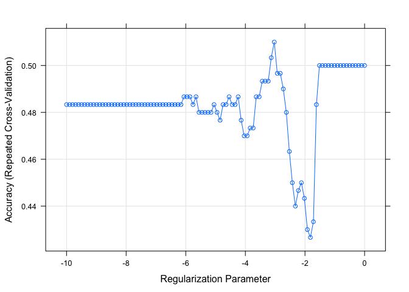
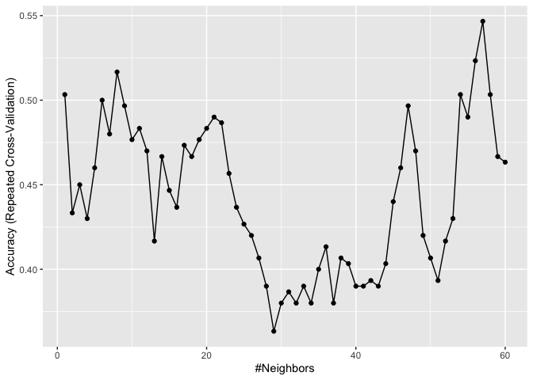
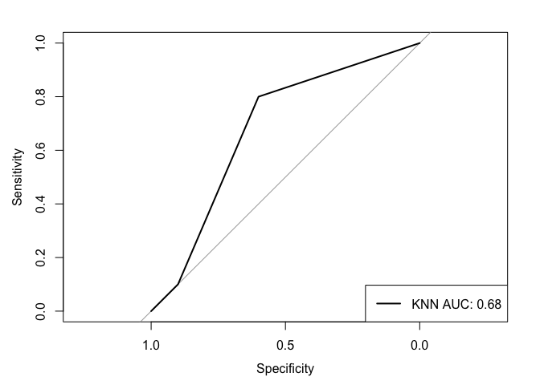

Lasso and KNN
================
Adeline Shin
5/17/2020

# Load Data and Split

``` r
load("./updated_bcp_data.RData")

set.seed(13)
training_rows = createDataPartition(y = bcp_data$node,
                                    p = 0.75,
                                    list = FALSE)

training_data = bcp_data[training_rows,]
test_data = bcp_data[-training_rows,]
```

# Model Specifications

``` r
ctrl = trainControl(method = "repeatedcv", repeats = 5, number = 10)
```

# Lasso

``` r
y = training_data$node
x = model.matrix(node ~ ., data = training_data)[, -1]

set.seed(13)
lasso_fit = train(x, y,
                  method = "glmnet",
                  trControl = ctrl,
                  preProcess = c("center", "scale"),
                  tuneGrid = expand.grid(alpha = 1, 
                                         lambda = exp(seq(-10, 0, length = 100))))

plot(lasso_fit, xTrans = function(x) log(x))
```

<!-- -->

``` r
lasso_coef = coef(lasso_fit$finalModel,lasso_fit$bestTune$lambda)

lasso_pred = predict(lasso_fit, newdata = test_data)
mse(test_data$node, lasso_pred)
```

    ## [1] 0.4

``` r
# Confusion Matrix
test_pred_prob = predict(lasso_fit, newdata = test_data,
                         type = "prob")
test_pred = rep("Negative", length(test_pred_prob$Negative))
test_pred[test_pred_prob$Negative < 0.5] = "Positive"

caret::confusionMatrix(data = as.factor(test_pred),
                       reference = test_data$node,
                       positive = "Positive")
```

    ## Confusion Matrix and Statistics
    ## 
    ##           Reference
    ## Prediction Negative Positive
    ##   Negative        6        4
    ##   Positive        4        6
    ##                                           
    ##                Accuracy : 0.6             
    ##                  95% CI : (0.3605, 0.8088)
    ##     No Information Rate : 0.5             
    ##     P-Value [Acc > NIR] : 0.2517          
    ##                                           
    ##                   Kappa : 0.2             
    ##                                           
    ##  Mcnemar's Test P-Value : 1.0000          
    ##                                           
    ##             Sensitivity : 0.6             
    ##             Specificity : 0.6             
    ##          Pos Pred Value : 0.6             
    ##          Neg Pred Value : 0.6             
    ##              Prevalence : 0.5             
    ##          Detection Rate : 0.3             
    ##    Detection Prevalence : 0.5             
    ##       Balanced Accuracy : 0.6             
    ##                                           
    ##        'Positive' Class : Positive        
    ## 

# KNN

``` r
set.seed(13)
knn_fit = train(x, y,
                method = "knn",
                preProcess = c("center", "scale"),
                tuneGrid = data.frame(k = seq(1, 60, by = 1)),
                trControl = ctrl)
```

    ## Warning in knn3Train(train = structure(c(1.57077711054981,
    ## 1.12403771473373, : k = 55 exceeds number 54 of patterns

    ## Warning in knn3Train(train = structure(c(1.57077711054981,
    ## 1.12403771473373, : k = 56 exceeds number 54 of patterns

    ## Warning in knn3Train(train = structure(c(1.57077711054981,
    ## 1.12403771473373, : k = 57 exceeds number 54 of patterns

    ## Warning in knn3Train(train = structure(c(1.57077711054981,
    ## 1.12403771473373, : k = 58 exceeds number 54 of patterns

    ## Warning in knn3Train(train = structure(c(1.57077711054981,
    ## 1.12403771473373, : k = 59 exceeds number 54 of patterns

    ## Warning in knn3Train(train = structure(c(1.57077711054981,
    ## 1.12403771473373, : k = 60 exceeds number 54 of patterns

    ## Warning in knn3Train(train = structure(c(1.56322101163936,
    ## 1.11903575609597, : k = 55 exceeds number 54 of patterns

    ## Warning in knn3Train(train = structure(c(1.56322101163936,
    ## 1.11903575609597, : k = 56 exceeds number 54 of patterns

    ## Warning in knn3Train(train = structure(c(1.56322101163936,
    ## 1.11903575609597, : k = 57 exceeds number 54 of patterns

    ## Warning in knn3Train(train = structure(c(1.56322101163936,
    ## 1.11903575609597, : k = 58 exceeds number 54 of patterns

    ## Warning in knn3Train(train = structure(c(1.56322101163936,
    ## 1.11903575609597, : k = 59 exceeds number 54 of patterns

    ## Warning in knn3Train(train = structure(c(1.56322101163936,
    ## 1.11903575609597, : k = 60 exceeds number 54 of patterns

    ## Warning in knn3Train(train = structure(c(1.57814406334064,
    ## 1.11906394032576, : k = 55 exceeds number 54 of patterns

    ## Warning in knn3Train(train = structure(c(1.57814406334064,
    ## 1.11906394032576, : k = 56 exceeds number 54 of patterns

    ## Warning in knn3Train(train = structure(c(1.57814406334064,
    ## 1.11906394032576, : k = 57 exceeds number 54 of patterns

    ## Warning in knn3Train(train = structure(c(1.57814406334064,
    ## 1.11906394032576, : k = 58 exceeds number 54 of patterns

    ## Warning in knn3Train(train = structure(c(1.57814406334064,
    ## 1.11906394032576, : k = 59 exceeds number 54 of patterns

    ## Warning in knn3Train(train = structure(c(1.57814406334064,
    ## 1.11906394032576, : k = 60 exceeds number 54 of patterns

    ## Warning in knn3Train(train = structure(c(1.61615964314157,
    ## 1.16306579642233, : k = 55 exceeds number 54 of patterns

    ## Warning in knn3Train(train = structure(c(1.61615964314157,
    ## 1.16306579642233, : k = 56 exceeds number 54 of patterns

    ## Warning in knn3Train(train = structure(c(1.61615964314157,
    ## 1.16306579642233, : k = 57 exceeds number 54 of patterns

    ## Warning in knn3Train(train = structure(c(1.61615964314157,
    ## 1.16306579642233, : k = 58 exceeds number 54 of patterns

    ## Warning in knn3Train(train = structure(c(1.61615964314157,
    ## 1.16306579642233, : k = 59 exceeds number 54 of patterns

    ## Warning in knn3Train(train = structure(c(1.61615964314157,
    ## 1.16306579642233, : k = 60 exceeds number 54 of patterns

    ## Warning in knn3Train(train = structure(c(1.78341125757431,
    ## 1.30267957827275, : k = 55 exceeds number 54 of patterns

    ## Warning in knn3Train(train = structure(c(1.78341125757431,
    ## 1.30267957827275, : k = 56 exceeds number 54 of patterns

    ## Warning in knn3Train(train = structure(c(1.78341125757431,
    ## 1.30267957827275, : k = 57 exceeds number 54 of patterns

    ## Warning in knn3Train(train = structure(c(1.78341125757431,
    ## 1.30267957827275, : k = 58 exceeds number 54 of patterns

    ## Warning in knn3Train(train = structure(c(1.78341125757431,
    ## 1.30267957827275, : k = 59 exceeds number 54 of patterns

    ## Warning in knn3Train(train = structure(c(1.78341125757431,
    ## 1.30267957827275, : k = 60 exceeds number 54 of patterns

    ## Warning in knn3Train(train = structure(c(1.72594166501107,
    ## 1.25862133246665, : k = 55 exceeds number 54 of patterns

    ## Warning in knn3Train(train = structure(c(1.72594166501107,
    ## 1.25862133246665, : k = 56 exceeds number 54 of patterns

    ## Warning in knn3Train(train = structure(c(1.72594166501107,
    ## 1.25862133246665, : k = 57 exceeds number 54 of patterns

    ## Warning in knn3Train(train = structure(c(1.72594166501107,
    ## 1.25862133246665, : k = 58 exceeds number 54 of patterns

    ## Warning in knn3Train(train = structure(c(1.72594166501107,
    ## 1.25862133246665, : k = 59 exceeds number 54 of patterns

    ## Warning in knn3Train(train = structure(c(1.72594166501107,
    ## 1.25862133246665, : k = 60 exceeds number 54 of patterns

    ## Warning in knn3Train(train = structure(c(1.69821344987051,
    ## 1.23792638652351, : k = 55 exceeds number 54 of patterns

    ## Warning in knn3Train(train = structure(c(1.69821344987051,
    ## 1.23792638652351, : k = 56 exceeds number 54 of patterns

    ## Warning in knn3Train(train = structure(c(1.69821344987051,
    ## 1.23792638652351, : k = 57 exceeds number 54 of patterns

    ## Warning in knn3Train(train = structure(c(1.69821344987051,
    ## 1.23792638652351, : k = 58 exceeds number 54 of patterns

    ## Warning in knn3Train(train = structure(c(1.69821344987051,
    ## 1.23792638652351, : k = 59 exceeds number 54 of patterns

    ## Warning in knn3Train(train = structure(c(1.69821344987051,
    ## 1.23792638652351, : k = 60 exceeds number 54 of patterns

    ## Warning in knn3Train(train = structure(c(1.62117643514821,
    ## 1.16571275124558, : k = 55 exceeds number 54 of patterns

    ## Warning in knn3Train(train = structure(c(1.62117643514821,
    ## 1.16571275124558, : k = 56 exceeds number 54 of patterns

    ## Warning in knn3Train(train = structure(c(1.62117643514821,
    ## 1.16571275124558, : k = 57 exceeds number 54 of patterns

    ## Warning in knn3Train(train = structure(c(1.62117643514821,
    ## 1.16571275124558, : k = 58 exceeds number 54 of patterns

    ## Warning in knn3Train(train = structure(c(1.62117643514821,
    ## 1.16571275124558, : k = 59 exceeds number 54 of patterns

    ## Warning in knn3Train(train = structure(c(1.62117643514821,
    ## 1.16571275124558, : k = 60 exceeds number 54 of patterns

    ## Warning in knn3Train(train = structure(c(1.31032076367079,
    ## -0.62873380253056, : k = 55 exceeds number 54 of patterns

    ## Warning in knn3Train(train = structure(c(1.31032076367079,
    ## -0.62873380253056, : k = 56 exceeds number 54 of patterns

    ## Warning in knn3Train(train = structure(c(1.31032076367079,
    ## -0.62873380253056, : k = 57 exceeds number 54 of patterns

    ## Warning in knn3Train(train = structure(c(1.31032076367079,
    ## -0.62873380253056, : k = 58 exceeds number 54 of patterns

    ## Warning in knn3Train(train = structure(c(1.31032076367079,
    ## -0.62873380253056, : k = 59 exceeds number 54 of patterns

    ## Warning in knn3Train(train = structure(c(1.31032076367079,
    ## -0.62873380253056, : k = 60 exceeds number 54 of patterns

    ## Warning in knn3Train(train = structure(c(1.58430460008173,
    ## -0.705696403911381, : k = 55 exceeds number 54 of patterns

    ## Warning in knn3Train(train = structure(c(1.58430460008173,
    ## -0.705696403911381, : k = 56 exceeds number 54 of patterns

    ## Warning in knn3Train(train = structure(c(1.58430460008173,
    ## -0.705696403911381, : k = 57 exceeds number 54 of patterns

    ## Warning in knn3Train(train = structure(c(1.58430460008173,
    ## -0.705696403911381, : k = 58 exceeds number 54 of patterns

    ## Warning in knn3Train(train = structure(c(1.58430460008173,
    ## -0.705696403911381, : k = 59 exceeds number 54 of patterns

    ## Warning in knn3Train(train = structure(c(1.58430460008173,
    ## -0.705696403911381, : k = 60 exceeds number 54 of patterns

    ## Warning in knn3Train(train = structure(c(1.78629067173153,
    ## 1.31108769350128, : k = 55 exceeds number 54 of patterns

    ## Warning in knn3Train(train = structure(c(1.78629067173153,
    ## 1.31108769350128, : k = 56 exceeds number 54 of patterns

    ## Warning in knn3Train(train = structure(c(1.78629067173153,
    ## 1.31108769350128, : k = 57 exceeds number 54 of patterns

    ## Warning in knn3Train(train = structure(c(1.78629067173153,
    ## 1.31108769350128, : k = 58 exceeds number 54 of patterns

    ## Warning in knn3Train(train = structure(c(1.78629067173153,
    ## 1.31108769350128, : k = 59 exceeds number 54 of patterns

    ## Warning in knn3Train(train = structure(c(1.78629067173153,
    ## 1.31108769350128, : k = 60 exceeds number 54 of patterns

    ## Warning in knn3Train(train = structure(c(1.76525072921392,
    ## 1.28000623968264, : k = 55 exceeds number 54 of patterns

    ## Warning in knn3Train(train = structure(c(1.76525072921392,
    ## 1.28000623968264, : k = 56 exceeds number 54 of patterns

    ## Warning in knn3Train(train = structure(c(1.76525072921392,
    ## 1.28000623968264, : k = 57 exceeds number 54 of patterns

    ## Warning in knn3Train(train = structure(c(1.76525072921392,
    ## 1.28000623968264, : k = 58 exceeds number 54 of patterns

    ## Warning in knn3Train(train = structure(c(1.76525072921392,
    ## 1.28000623968264, : k = 59 exceeds number 54 of patterns

    ## Warning in knn3Train(train = structure(c(1.76525072921392,
    ## 1.28000623968264, : k = 60 exceeds number 54 of patterns

    ## Warning in knn3Train(train = structure(c(-0.593525413085384,
    ## -0.857834067295692, : k = 55 exceeds number 54 of patterns

    ## Warning in knn3Train(train = structure(c(-0.593525413085384,
    ## -0.857834067295692, : k = 56 exceeds number 54 of patterns

    ## Warning in knn3Train(train = structure(c(-0.593525413085384,
    ## -0.857834067295692, : k = 57 exceeds number 54 of patterns

    ## Warning in knn3Train(train = structure(c(-0.593525413085384,
    ## -0.857834067295692, : k = 58 exceeds number 54 of patterns

    ## Warning in knn3Train(train = structure(c(-0.593525413085384,
    ## -0.857834067295692, : k = 59 exceeds number 54 of patterns

    ## Warning in knn3Train(train = structure(c(-0.593525413085384,
    ## -0.857834067295692, : k = 60 exceeds number 54 of patterns

    ## Warning in knn3Train(train = structure(c(1.537848894318,
    ## 1.09399889116368, : k = 55 exceeds number 54 of patterns

    ## Warning in knn3Train(train = structure(c(1.537848894318,
    ## 1.09399889116368, : k = 56 exceeds number 54 of patterns

    ## Warning in knn3Train(train = structure(c(1.537848894318,
    ## 1.09399889116368, : k = 57 exceeds number 54 of patterns

    ## Warning in knn3Train(train = structure(c(1.537848894318,
    ## 1.09399889116368, : k = 58 exceeds number 54 of patterns

    ## Warning in knn3Train(train = structure(c(1.537848894318,
    ## 1.09399889116368, : k = 59 exceeds number 54 of patterns

    ## Warning in knn3Train(train = structure(c(1.537848894318,
    ## 1.09399889116368, : k = 60 exceeds number 54 of patterns

    ## Warning in knn3Train(train = structure(c(1.58084372541107,
    ## 1.12833342299844, : k = 55 exceeds number 54 of patterns

    ## Warning in knn3Train(train = structure(c(1.58084372541107,
    ## 1.12833342299844, : k = 56 exceeds number 54 of patterns

    ## Warning in knn3Train(train = structure(c(1.58084372541107,
    ## 1.12833342299844, : k = 57 exceeds number 54 of patterns

    ## Warning in knn3Train(train = structure(c(1.58084372541107,
    ## 1.12833342299844, : k = 58 exceeds number 54 of patterns

    ## Warning in knn3Train(train = structure(c(1.58084372541107,
    ## 1.12833342299844, : k = 59 exceeds number 54 of patterns

    ## Warning in knn3Train(train = structure(c(1.58084372541107,
    ## 1.12833342299844, : k = 60 exceeds number 54 of patterns

    ## Warning in knn3Train(train = structure(c(1.62866506145287,
    ## 1.17149070154385, : k = 55 exceeds number 54 of patterns

    ## Warning in knn3Train(train = structure(c(1.62866506145287,
    ## 1.17149070154385, : k = 56 exceeds number 54 of patterns

    ## Warning in knn3Train(train = structure(c(1.62866506145287,
    ## 1.17149070154385, : k = 57 exceeds number 54 of patterns

    ## Warning in knn3Train(train = structure(c(1.62866506145287,
    ## 1.17149070154385, : k = 58 exceeds number 54 of patterns

    ## Warning in knn3Train(train = structure(c(1.62866506145287,
    ## 1.17149070154385, : k = 59 exceeds number 54 of patterns

    ## Warning in knn3Train(train = structure(c(1.62866506145287,
    ## 1.17149070154385, : k = 60 exceeds number 54 of patterns

    ## Warning in knn3Train(train = structure(c(1.67966419316071,
    ## 1.2154546810765, : k = 55 exceeds number 54 of patterns

    ## Warning in knn3Train(train = structure(c(1.67966419316071,
    ## 1.2154546810765, : k = 56 exceeds number 54 of patterns

    ## Warning in knn3Train(train = structure(c(1.67966419316071,
    ## 1.2154546810765, : k = 57 exceeds number 54 of patterns

    ## Warning in knn3Train(train = structure(c(1.67966419316071,
    ## 1.2154546810765, : k = 58 exceeds number 54 of patterns

    ## Warning in knn3Train(train = structure(c(1.67966419316071,
    ## 1.2154546810765, : k = 59 exceeds number 54 of patterns

    ## Warning in knn3Train(train = structure(c(1.67966419316071,
    ## 1.2154546810765, : k = 60 exceeds number 54 of patterns

    ## Warning in knn3Train(train = structure(c(1.63924905483291,
    ## 1.18560178417526, : k = 55 exceeds number 54 of patterns

    ## Warning in knn3Train(train = structure(c(1.63924905483291,
    ## 1.18560178417526, : k = 56 exceeds number 54 of patterns

    ## Warning in knn3Train(train = structure(c(1.63924905483291,
    ## 1.18560178417526, : k = 57 exceeds number 54 of patterns

    ## Warning in knn3Train(train = structure(c(1.63924905483291,
    ## 1.18560178417526, : k = 58 exceeds number 54 of patterns

    ## Warning in knn3Train(train = structure(c(1.63924905483291,
    ## 1.18560178417526, : k = 59 exceeds number 54 of patterns

    ## Warning in knn3Train(train = structure(c(1.63924905483291,
    ## 1.18560178417526, : k = 60 exceeds number 54 of patterns

    ## Warning in knn3Train(train = structure(c(1.57494590816724,
    ## 1.12824994634841, : k = 55 exceeds number 54 of patterns

    ## Warning in knn3Train(train = structure(c(1.57494590816724,
    ## 1.12824994634841, : k = 56 exceeds number 54 of patterns

    ## Warning in knn3Train(train = structure(c(1.57494590816724,
    ## 1.12824994634841, : k = 57 exceeds number 54 of patterns

    ## Warning in knn3Train(train = structure(c(1.57494590816724,
    ## 1.12824994634841, : k = 58 exceeds number 54 of patterns

    ## Warning in knn3Train(train = structure(c(1.57494590816724,
    ## 1.12824994634841, : k = 59 exceeds number 54 of patterns

    ## Warning in knn3Train(train = structure(c(1.57494590816724,
    ## 1.12824994634841, : k = 60 exceeds number 54 of patterns

    ## Warning in knn3Train(train = structure(c(1.56013187636978,
    ## 1.11355173517465, : k = 55 exceeds number 54 of patterns

    ## Warning in knn3Train(train = structure(c(1.56013187636978,
    ## 1.11355173517465, : k = 56 exceeds number 54 of patterns

    ## Warning in knn3Train(train = structure(c(1.56013187636978,
    ## 1.11355173517465, : k = 57 exceeds number 54 of patterns

    ## Warning in knn3Train(train = structure(c(1.56013187636978,
    ## 1.11355173517465, : k = 58 exceeds number 54 of patterns

    ## Warning in knn3Train(train = structure(c(1.56013187636978,
    ## 1.11355173517465, : k = 59 exceeds number 54 of patterns

    ## Warning in knn3Train(train = structure(c(1.56013187636978,
    ## 1.11355173517465, : k = 60 exceeds number 54 of patterns

    ## Warning in knn3Train(train = structure(c(1.65194700721035,
    ## 1.19410028195905, : k = 55 exceeds number 54 of patterns

    ## Warning in knn3Train(train = structure(c(1.65194700721035,
    ## 1.19410028195905, : k = 56 exceeds number 54 of patterns

    ## Warning in knn3Train(train = structure(c(1.65194700721035,
    ## 1.19410028195905, : k = 57 exceeds number 54 of patterns

    ## Warning in knn3Train(train = structure(c(1.65194700721035,
    ## 1.19410028195905, : k = 58 exceeds number 54 of patterns

    ## Warning in knn3Train(train = structure(c(1.65194700721035,
    ## 1.19410028195905, : k = 59 exceeds number 54 of patterns

    ## Warning in knn3Train(train = structure(c(1.65194700721035,
    ## 1.19410028195905, : k = 60 exceeds number 54 of patterns

    ## Warning in knn3Train(train = structure(c(1.75597837535261,
    ## 1.28134677803447, : k = 55 exceeds number 54 of patterns

    ## Warning in knn3Train(train = structure(c(1.75597837535261,
    ## 1.28134677803447, : k = 56 exceeds number 54 of patterns

    ## Warning in knn3Train(train = structure(c(1.75597837535261,
    ## 1.28134677803447, : k = 57 exceeds number 54 of patterns

    ## Warning in knn3Train(train = structure(c(1.75597837535261,
    ## 1.28134677803447, : k = 58 exceeds number 54 of patterns

    ## Warning in knn3Train(train = structure(c(1.75597837535261,
    ## 1.28134677803447, : k = 59 exceeds number 54 of patterns

    ## Warning in knn3Train(train = structure(c(1.75597837535261,
    ## 1.28134677803447, : k = 60 exceeds number 54 of patterns

    ## Warning in knn3Train(train = structure(c(1.64504526424626,
    ## 1.18846662475717, : k = 55 exceeds number 54 of patterns

    ## Warning in knn3Train(train = structure(c(1.64504526424626,
    ## 1.18846662475717, : k = 56 exceeds number 54 of patterns

    ## Warning in knn3Train(train = structure(c(1.64504526424626,
    ## 1.18846662475717, : k = 57 exceeds number 54 of patterns

    ## Warning in knn3Train(train = structure(c(1.64504526424626,
    ## 1.18846662475717, : k = 58 exceeds number 54 of patterns

    ## Warning in knn3Train(train = structure(c(1.64504526424626,
    ## 1.18846662475717, : k = 59 exceeds number 54 of patterns

    ## Warning in knn3Train(train = structure(c(1.64504526424626,
    ## 1.18846662475717, : k = 60 exceeds number 54 of patterns

    ## Warning in knn3Train(train = structure(c(1.15699234877601,
    ## -0.699956786192846, : k = 55 exceeds number 54 of patterns

    ## Warning in knn3Train(train = structure(c(1.15699234877601,
    ## -0.699956786192846, : k = 56 exceeds number 54 of patterns

    ## Warning in knn3Train(train = structure(c(1.15699234877601,
    ## -0.699956786192846, : k = 57 exceeds number 54 of patterns

    ## Warning in knn3Train(train = structure(c(1.15699234877601,
    ## -0.699956786192846, : k = 58 exceeds number 54 of patterns

    ## Warning in knn3Train(train = structure(c(1.15699234877601,
    ## -0.699956786192846, : k = 59 exceeds number 54 of patterns

    ## Warning in knn3Train(train = structure(c(1.15699234877601,
    ## -0.699956786192846, : k = 60 exceeds number 54 of patterns

    ## Warning in knn3Train(train = structure(c(1.61644468851694,
    ## 1.1623043839419, : k = 55 exceeds number 54 of patterns

    ## Warning in knn3Train(train = structure(c(1.61644468851694,
    ## 1.1623043839419, : k = 56 exceeds number 54 of patterns

    ## Warning in knn3Train(train = structure(c(1.61644468851694,
    ## 1.1623043839419, : k = 57 exceeds number 54 of patterns

    ## Warning in knn3Train(train = structure(c(1.61644468851694,
    ## 1.1623043839419, : k = 58 exceeds number 54 of patterns

    ## Warning in knn3Train(train = structure(c(1.61644468851694,
    ## 1.1623043839419, : k = 59 exceeds number 54 of patterns

    ## Warning in knn3Train(train = structure(c(1.61644468851694,
    ## 1.1623043839419, : k = 60 exceeds number 54 of patterns

    ## Warning in knn3Train(train = structure(c(1.54239912750571,
    ## 1.09793538020977, : k = 55 exceeds number 54 of patterns

    ## Warning in knn3Train(train = structure(c(1.54239912750571,
    ## 1.09793538020977, : k = 56 exceeds number 54 of patterns

    ## Warning in knn3Train(train = structure(c(1.54239912750571,
    ## 1.09793538020977, : k = 57 exceeds number 54 of patterns

    ## Warning in knn3Train(train = structure(c(1.54239912750571,
    ## 1.09793538020977, : k = 58 exceeds number 54 of patterns

    ## Warning in knn3Train(train = structure(c(1.54239912750571,
    ## 1.09793538020977, : k = 59 exceeds number 54 of patterns

    ## Warning in knn3Train(train = structure(c(1.54239912750571,
    ## 1.09793538020977, : k = 60 exceeds number 54 of patterns

    ## Warning in knn3Train(train = structure(c(1.7387610763004,
    ## 1.26262515427889, : k = 55 exceeds number 54 of patterns

    ## Warning in knn3Train(train = structure(c(1.7387610763004,
    ## 1.26262515427889, : k = 56 exceeds number 54 of patterns

    ## Warning in knn3Train(train = structure(c(1.7387610763004,
    ## 1.26262515427889, : k = 57 exceeds number 54 of patterns

    ## Warning in knn3Train(train = structure(c(1.7387610763004,
    ## 1.26262515427889, : k = 58 exceeds number 54 of patterns

    ## Warning in knn3Train(train = structure(c(1.7387610763004,
    ## 1.26262515427889, : k = 59 exceeds number 54 of patterns

    ## Warning in knn3Train(train = structure(c(1.7387610763004,
    ## 1.26262515427889, : k = 60 exceeds number 54 of patterns

    ## Warning in knn3Train(train = structure(c(1.58411441570926,
    ## 1.13661751565512, : k = 55 exceeds number 54 of patterns

    ## Warning in knn3Train(train = structure(c(1.58411441570926,
    ## 1.13661751565512, : k = 56 exceeds number 54 of patterns

    ## Warning in knn3Train(train = structure(c(1.58411441570926,
    ## 1.13661751565512, : k = 57 exceeds number 54 of patterns

    ## Warning in knn3Train(train = structure(c(1.58411441570926,
    ## 1.13661751565512, : k = 58 exceeds number 54 of patterns

    ## Warning in knn3Train(train = structure(c(1.58411441570926,
    ## 1.13661751565512, : k = 59 exceeds number 54 of patterns

    ## Warning in knn3Train(train = structure(c(1.58411441570926,
    ## 1.13661751565512, : k = 60 exceeds number 54 of patterns

    ## Warning in knn3Train(train = structure(c(1.60136489050625,
    ## 1.15586605682073, : k = 55 exceeds number 54 of patterns

    ## Warning in knn3Train(train = structure(c(1.60136489050625,
    ## 1.15586605682073, : k = 56 exceeds number 54 of patterns

    ## Warning in knn3Train(train = structure(c(1.60136489050625,
    ## 1.15586605682073, : k = 57 exceeds number 54 of patterns

    ## Warning in knn3Train(train = structure(c(1.60136489050625,
    ## 1.15586605682073, : k = 58 exceeds number 54 of patterns

    ## Warning in knn3Train(train = structure(c(1.60136489050625,
    ## 1.15586605682073, : k = 59 exceeds number 54 of patterns

    ## Warning in knn3Train(train = structure(c(1.60136489050625,
    ## 1.15586605682073, : k = 60 exceeds number 54 of patterns

    ## Warning in knn3Train(train = structure(c(1.76956244285784,
    ## -0.663172993224603, : k = 55 exceeds number 54 of patterns

    ## Warning in knn3Train(train = structure(c(1.76956244285784,
    ## -0.663172993224603, : k = 56 exceeds number 54 of patterns

    ## Warning in knn3Train(train = structure(c(1.76956244285784,
    ## -0.663172993224603, : k = 57 exceeds number 54 of patterns

    ## Warning in knn3Train(train = structure(c(1.76956244285784,
    ## -0.663172993224603, : k = 58 exceeds number 54 of patterns

    ## Warning in knn3Train(train = structure(c(1.76956244285784,
    ## -0.663172993224603, : k = 59 exceeds number 54 of patterns

    ## Warning in knn3Train(train = structure(c(1.76956244285784,
    ## -0.663172993224603, : k = 60 exceeds number 54 of patterns

    ## Warning in knn3Train(train = structure(c(1.5688357338475,
    ## 1.12501111562179, : k = 55 exceeds number 54 of patterns

    ## Warning in knn3Train(train = structure(c(1.5688357338475,
    ## 1.12501111562179, : k = 56 exceeds number 54 of patterns

    ## Warning in knn3Train(train = structure(c(1.5688357338475,
    ## 1.12501111562179, : k = 57 exceeds number 54 of patterns

    ## Warning in knn3Train(train = structure(c(1.5688357338475,
    ## 1.12501111562179, : k = 58 exceeds number 54 of patterns

    ## Warning in knn3Train(train = structure(c(1.5688357338475,
    ## 1.12501111562179, : k = 59 exceeds number 54 of patterns

    ## Warning in knn3Train(train = structure(c(1.5688357338475,
    ## 1.12501111562179, : k = 60 exceeds number 54 of patterns

    ## Warning in knn3Train(train = structure(c(1.69900701063833,
    ## 1.23798957288842, : k = 55 exceeds number 54 of patterns

    ## Warning in knn3Train(train = structure(c(1.69900701063833,
    ## 1.23798957288842, : k = 56 exceeds number 54 of patterns

    ## Warning in knn3Train(train = structure(c(1.69900701063833,
    ## 1.23798957288842, : k = 57 exceeds number 54 of patterns

    ## Warning in knn3Train(train = structure(c(1.69900701063833,
    ## 1.23798957288842, : k = 58 exceeds number 54 of patterns

    ## Warning in knn3Train(train = structure(c(1.69900701063833,
    ## 1.23798957288842, : k = 59 exceeds number 54 of patterns

    ## Warning in knn3Train(train = structure(c(1.69900701063833,
    ## 1.23798957288842, : k = 60 exceeds number 54 of patterns

    ## Warning in knn3Train(train = structure(c(1.69491505874228,
    ## 1.23645204393228, : k = 55 exceeds number 54 of patterns

    ## Warning in knn3Train(train = structure(c(1.69491505874228,
    ## 1.23645204393228, : k = 56 exceeds number 54 of patterns

    ## Warning in knn3Train(train = structure(c(1.69491505874228,
    ## 1.23645204393228, : k = 57 exceeds number 54 of patterns

    ## Warning in knn3Train(train = structure(c(1.69491505874228,
    ## 1.23645204393228, : k = 58 exceeds number 54 of patterns

    ## Warning in knn3Train(train = structure(c(1.69491505874228,
    ## 1.23645204393228, : k = 59 exceeds number 54 of patterns

    ## Warning in knn3Train(train = structure(c(1.69491505874228,
    ## 1.23645204393228, : k = 60 exceeds number 54 of patterns

    ## Warning in knn3Train(train = structure(c(1.22137370587409,
    ## -0.705727716491656, : k = 55 exceeds number 54 of patterns

    ## Warning in knn3Train(train = structure(c(1.22137370587409,
    ## -0.705727716491656, : k = 56 exceeds number 54 of patterns

    ## Warning in knn3Train(train = structure(c(1.22137370587409,
    ## -0.705727716491656, : k = 57 exceeds number 54 of patterns

    ## Warning in knn3Train(train = structure(c(1.22137370587409,
    ## -0.705727716491656, : k = 58 exceeds number 54 of patterns

    ## Warning in knn3Train(train = structure(c(1.22137370587409,
    ## -0.705727716491656, : k = 59 exceeds number 54 of patterns

    ## Warning in knn3Train(train = structure(c(1.22137370587409,
    ## -0.705727716491656, : k = 60 exceeds number 54 of patterns

    ## Warning in knn3Train(train = structure(c(1.65441290163495,
    ## 1.1857705928663, : k = 55 exceeds number 54 of patterns

    ## Warning in knn3Train(train = structure(c(1.65441290163495,
    ## 1.1857705928663, : k = 56 exceeds number 54 of patterns

    ## Warning in knn3Train(train = structure(c(1.65441290163495,
    ## 1.1857705928663, : k = 57 exceeds number 54 of patterns

    ## Warning in knn3Train(train = structure(c(1.65441290163495,
    ## 1.1857705928663, : k = 58 exceeds number 54 of patterns

    ## Warning in knn3Train(train = structure(c(1.65441290163495,
    ## 1.1857705928663, : k = 59 exceeds number 54 of patterns

    ## Warning in knn3Train(train = structure(c(1.65441290163495,
    ## 1.1857705928663, : k = 60 exceeds number 54 of patterns

    ## Warning in knn3Train(train = structure(c(1.56665285210637,
    ## 1.12543222046719, : k = 55 exceeds number 54 of patterns

    ## Warning in knn3Train(train = structure(c(1.56665285210637,
    ## 1.12543222046719, : k = 56 exceeds number 54 of patterns

    ## Warning in knn3Train(train = structure(c(1.56665285210637,
    ## 1.12543222046719, : k = 57 exceeds number 54 of patterns

    ## Warning in knn3Train(train = structure(c(1.56665285210637,
    ## 1.12543222046719, : k = 58 exceeds number 54 of patterns

    ## Warning in knn3Train(train = structure(c(1.56665285210637,
    ## 1.12543222046719, : k = 59 exceeds number 54 of patterns

    ## Warning in knn3Train(train = structure(c(1.56665285210637,
    ## 1.12543222046719, : k = 60 exceeds number 54 of patterns

    ## Warning in knn3Train(train = structure(c(1.61004887050342,
    ## 1.16122077551464, : k = 55 exceeds number 54 of patterns

    ## Warning in knn3Train(train = structure(c(1.61004887050342,
    ## 1.16122077551464, : k = 56 exceeds number 54 of patterns

    ## Warning in knn3Train(train = structure(c(1.61004887050342,
    ## 1.16122077551464, : k = 57 exceeds number 54 of patterns

    ## Warning in knn3Train(train = structure(c(1.61004887050342,
    ## 1.16122077551464, : k = 58 exceeds number 54 of patterns

    ## Warning in knn3Train(train = structure(c(1.61004887050342,
    ## 1.16122077551464, : k = 59 exceeds number 54 of patterns

    ## Warning in knn3Train(train = structure(c(1.61004887050342,
    ## 1.16122077551464, : k = 60 exceeds number 54 of patterns

    ## Warning in knn3Train(train = structure(c(1.65216707642178,
    ## 1.1945957723894, : k = 55 exceeds number 54 of patterns

    ## Warning in knn3Train(train = structure(c(1.65216707642178,
    ## 1.1945957723894, : k = 56 exceeds number 54 of patterns

    ## Warning in knn3Train(train = structure(c(1.65216707642178,
    ## 1.1945957723894, : k = 57 exceeds number 54 of patterns

    ## Warning in knn3Train(train = structure(c(1.65216707642178,
    ## 1.1945957723894, : k = 58 exceeds number 54 of patterns

    ## Warning in knn3Train(train = structure(c(1.65216707642178,
    ## 1.1945957723894, : k = 59 exceeds number 54 of patterns

    ## Warning in knn3Train(train = structure(c(1.65216707642178,
    ## 1.1945957723894, : k = 60 exceeds number 54 of patterns

    ## Warning in knn3Train(train = structure(c(1.70341708835149,
    ## -0.670751542193261, : k = 55 exceeds number 54 of patterns

    ## Warning in knn3Train(train = structure(c(1.70341708835149,
    ## -0.670751542193261, : k = 56 exceeds number 54 of patterns

    ## Warning in knn3Train(train = structure(c(1.70341708835149,
    ## -0.670751542193261, : k = 57 exceeds number 54 of patterns

    ## Warning in knn3Train(train = structure(c(1.70341708835149,
    ## -0.670751542193261, : k = 58 exceeds number 54 of patterns

    ## Warning in knn3Train(train = structure(c(1.70341708835149,
    ## -0.670751542193261, : k = 59 exceeds number 54 of patterns

    ## Warning in knn3Train(train = structure(c(1.70341708835149,
    ## -0.670751542193261, : k = 60 exceeds number 54 of patterns

    ## Warning in knn3Train(train = structure(c(1.66129484220498,
    ## 1.1916323633682, : k = 55 exceeds number 54 of patterns

    ## Warning in knn3Train(train = structure(c(1.66129484220498,
    ## 1.1916323633682, : k = 56 exceeds number 54 of patterns

    ## Warning in knn3Train(train = structure(c(1.66129484220498,
    ## 1.1916323633682, : k = 57 exceeds number 54 of patterns

    ## Warning in knn3Train(train = structure(c(1.66129484220498,
    ## 1.1916323633682, : k = 58 exceeds number 54 of patterns

    ## Warning in knn3Train(train = structure(c(1.66129484220498,
    ## 1.1916323633682, : k = 59 exceeds number 54 of patterns

    ## Warning in knn3Train(train = structure(c(1.66129484220498,
    ## 1.1916323633682, : k = 60 exceeds number 54 of patterns

    ## Warning in knn3Train(train = structure(c(1.59423919168861,
    ## 1.15145872249158, : k = 55 exceeds number 54 of patterns

    ## Warning in knn3Train(train = structure(c(1.59423919168861,
    ## 1.15145872249158, : k = 56 exceeds number 54 of patterns

    ## Warning in knn3Train(train = structure(c(1.59423919168861,
    ## 1.15145872249158, : k = 57 exceeds number 54 of patterns

    ## Warning in knn3Train(train = structure(c(1.59423919168861,
    ## 1.15145872249158, : k = 58 exceeds number 54 of patterns

    ## Warning in knn3Train(train = structure(c(1.59423919168861,
    ## 1.15145872249158, : k = 59 exceeds number 54 of patterns

    ## Warning in knn3Train(train = structure(c(1.59423919168861,
    ## 1.15145872249158, : k = 60 exceeds number 54 of patterns

    ## Warning in knn3Train(train = structure(c(1.57639307518015,
    ## 1.12771589094803, : k = 55 exceeds number 54 of patterns

    ## Warning in knn3Train(train = structure(c(1.57639307518015,
    ## 1.12771589094803, : k = 56 exceeds number 54 of patterns

    ## Warning in knn3Train(train = structure(c(1.57639307518015,
    ## 1.12771589094803, : k = 57 exceeds number 54 of patterns

    ## Warning in knn3Train(train = structure(c(1.57639307518015,
    ## 1.12771589094803, : k = 58 exceeds number 54 of patterns

    ## Warning in knn3Train(train = structure(c(1.57639307518015,
    ## 1.12771589094803, : k = 59 exceeds number 54 of patterns

    ## Warning in knn3Train(train = structure(c(1.57639307518015,
    ## 1.12771589094803, : k = 60 exceeds number 54 of patterns

    ## Warning in knn3Train(train = structure(c(1.66976829879009,
    ## 1.20679855306001, : k = 55 exceeds number 54 of patterns

    ## Warning in knn3Train(train = structure(c(1.66976829879009,
    ## 1.20679855306001, : k = 56 exceeds number 54 of patterns

    ## Warning in knn3Train(train = structure(c(1.66976829879009,
    ## 1.20679855306001, : k = 57 exceeds number 54 of patterns

    ## Warning in knn3Train(train = structure(c(1.66976829879009,
    ## 1.20679855306001, : k = 58 exceeds number 54 of patterns

    ## Warning in knn3Train(train = structure(c(1.66976829879009,
    ## 1.20679855306001, : k = 59 exceeds number 54 of patterns

    ## Warning in knn3Train(train = structure(c(1.66976829879009,
    ## 1.20679855306001, : k = 60 exceeds number 54 of patterns

    ## Warning in knn3Train(train = structure(c(1.55821627822649,
    ## 1.11873785941285, : k = 55 exceeds number 54 of patterns

    ## Warning in knn3Train(train = structure(c(1.55821627822649,
    ## 1.11873785941285, : k = 56 exceeds number 54 of patterns

    ## Warning in knn3Train(train = structure(c(1.55821627822649,
    ## 1.11873785941285, : k = 57 exceeds number 54 of patterns

    ## Warning in knn3Train(train = structure(c(1.55821627822649,
    ## 1.11873785941285, : k = 58 exceeds number 54 of patterns

    ## Warning in knn3Train(train = structure(c(1.55821627822649,
    ## 1.11873785941285, : k = 59 exceeds number 54 of patterns

    ## Warning in knn3Train(train = structure(c(1.55821627822649,
    ## 1.11873785941285, : k = 60 exceeds number 54 of patterns

    ## Warning in knn3Train(train = structure(c(1.66063066237977,
    ## 1.20045985317715, : k = 55 exceeds number 54 of patterns

    ## Warning in knn3Train(train = structure(c(1.66063066237977,
    ## 1.20045985317715, : k = 56 exceeds number 54 of patterns

    ## Warning in knn3Train(train = structure(c(1.66063066237977,
    ## 1.20045985317715, : k = 57 exceeds number 54 of patterns

    ## Warning in knn3Train(train = structure(c(1.66063066237977,
    ## 1.20045985317715, : k = 58 exceeds number 54 of patterns

    ## Warning in knn3Train(train = structure(c(1.66063066237977,
    ## 1.20045985317715, : k = 59 exceeds number 54 of patterns

    ## Warning in knn3Train(train = structure(c(1.66063066237977,
    ## 1.20045985317715, : k = 60 exceeds number 54 of patterns

    ## Warning in knn3Train(train = structure(c(1.67644852542024,
    ## 1.20753190516396, : k = 55 exceeds number 54 of patterns

    ## Warning in knn3Train(train = structure(c(1.67644852542024,
    ## 1.20753190516396, : k = 56 exceeds number 54 of patterns

    ## Warning in knn3Train(train = structure(c(1.67644852542024,
    ## 1.20753190516396, : k = 57 exceeds number 54 of patterns

    ## Warning in knn3Train(train = structure(c(1.67644852542024,
    ## 1.20753190516396, : k = 58 exceeds number 54 of patterns

    ## Warning in knn3Train(train = structure(c(1.67644852542024,
    ## 1.20753190516396, : k = 59 exceeds number 54 of patterns

    ## Warning in knn3Train(train = structure(c(1.67644852542024,
    ## 1.20753190516396, : k = 60 exceeds number 54 of patterns

    ## Warning in knn3Train(train = structure(c(1.59684700460337,
    ## 1.14029491677371, : k = 55 exceeds number 54 of patterns

    ## Warning in knn3Train(train = structure(c(1.59684700460337,
    ## 1.14029491677371, : k = 56 exceeds number 54 of patterns

    ## Warning in knn3Train(train = structure(c(1.59684700460337,
    ## 1.14029491677371, : k = 57 exceeds number 54 of patterns

    ## Warning in knn3Train(train = structure(c(1.59684700460337,
    ## 1.14029491677371, : k = 58 exceeds number 54 of patterns

    ## Warning in knn3Train(train = structure(c(1.59684700460337,
    ## 1.14029491677371, : k = 59 exceeds number 54 of patterns

    ## Warning in knn3Train(train = structure(c(1.59684700460337,
    ## 1.14029491677371, : k = 60 exceeds number 54 of patterns

    ## Warning in knn3Train(train = structure(c(1.65031882259408,
    ## -0.663731227759683, : k = 55 exceeds number 54 of patterns

    ## Warning in knn3Train(train = structure(c(1.65031882259408,
    ## -0.663731227759683, : k = 56 exceeds number 54 of patterns

    ## Warning in knn3Train(train = structure(c(1.65031882259408,
    ## -0.663731227759683, : k = 57 exceeds number 54 of patterns

    ## Warning in knn3Train(train = structure(c(1.65031882259408,
    ## -0.663731227759683, : k = 58 exceeds number 54 of patterns

    ## Warning in knn3Train(train = structure(c(1.65031882259408,
    ## -0.663731227759683, : k = 59 exceeds number 54 of patterns

    ## Warning in knn3Train(train = structure(c(1.65031882259408,
    ## -0.663731227759683, : k = 60 exceeds number 54 of patterns

    ## Warning in knn3Train(train = structure(c(1.2582694972787,
    ## -0.676985785042854, : k = 55 exceeds number 54 of patterns

    ## Warning in knn3Train(train = structure(c(1.2582694972787,
    ## -0.676985785042854, : k = 56 exceeds number 54 of patterns

    ## Warning in knn3Train(train = structure(c(1.2582694972787,
    ## -0.676985785042854, : k = 57 exceeds number 54 of patterns

    ## Warning in knn3Train(train = structure(c(1.2582694972787,
    ## -0.676985785042854, : k = 58 exceeds number 54 of patterns

    ## Warning in knn3Train(train = structure(c(1.2582694972787,
    ## -0.676985785042854, : k = 59 exceeds number 54 of patterns

    ## Warning in knn3Train(train = structure(c(1.2582694972787,
    ## -0.676985785042854, : k = 60 exceeds number 54 of patterns

    ## Warning in knn3Train(train = structure(c(1.80213252278984,
    ## 1.32030688380045, : k = 55 exceeds number 54 of patterns

    ## Warning in knn3Train(train = structure(c(1.80213252278984,
    ## 1.32030688380045, : k = 56 exceeds number 54 of patterns

    ## Warning in knn3Train(train = structure(c(1.80213252278984,
    ## 1.32030688380045, : k = 57 exceeds number 54 of patterns

    ## Warning in knn3Train(train = structure(c(1.80213252278984,
    ## 1.32030688380045, : k = 58 exceeds number 54 of patterns

    ## Warning in knn3Train(train = structure(c(1.80213252278984,
    ## 1.32030688380045, : k = 59 exceeds number 54 of patterns

    ## Warning in knn3Train(train = structure(c(1.80213252278984,
    ## 1.32030688380045, : k = 60 exceeds number 54 of patterns

``` r
ggplot(knn_fit)
```

<!-- -->

``` r
knn_pred = predict(knn_fit, newdata = test_data, type = "prob")[,2]
knn_roc = roc(test_data$node, knn_pred)
```

    ## Setting levels: control = Negative, case = Positive

    ## Setting direction: controls > cases

``` r
plot(knn_roc)
legend("bottomright", legend = paste0("KNN AUC", ": ", round(knn_roc$auc, 3)),
       col = 1:4, lwd = 2)
```

<!-- -->
