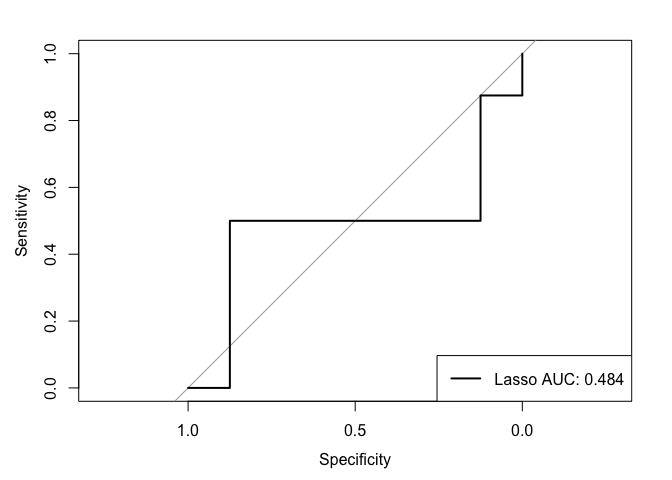

Lasso and KNN
================
Adeline Shin
5/17/2020

# Load Data and Split

``` r
load("./updated_bcp_data.RData")

set.seed(13)
training_rows = createDataPartition(y = bcp_data$node,
                                    p = 0.8,
                                    list = FALSE)

bcp_train = bcp_data[training_rows,]
bcp_test = bcp_data[-training_rows,]
```

# Model Specifications

``` r
ctrl = trainControl(method = "repeatedcv", repeats = 5, number = 10,
                    summaryFunction = twoClassSummary,
                    classProbs = TRUE)
```

# Lasso

``` r
y = bcp_train$node
x = model.matrix(node ~ ., data = bcp_train)[, -1]

set.seed(13)
lasso_fit = train(x, y,
                  method = "glmnet",
                  family = "binomial",
                  trControl = ctrl,
                  metric = "ROC",
                  preProcess = c("center", "scale"),
                  tuneGrid = expand.grid(alpha = 1, 
                                         lambda = exp(seq(-10, 0, length = 100))))

plot(lasso_fit, xTrans = function(x) log(x))
```

<!-- -->

``` r
lasso_pred = predict(lasso_fit, newdata = bcp_test, type = "prob")[,2]
lasso_roc = roc(bcp_test$node, lasso_pred)
```

    ## Setting levels: control = Negative, case = Positive

    ## Setting direction: controls > cases

``` r
plot(lasso_roc)
legend("bottomright", legend = paste0("Lasso AUC", ": ", round(lasso_roc$auc, 3)),
       col = 1:4, lwd = 2)
```

<!-- -->

``` r
lasso_coef = coef(lasso_fit$finalModel,lasso_fit$bestTune$lambda)

lasso_pred = predict(lasso_fit, newdata = bcp_test)
mse(bcp_test$node, lasso_pred)
```

    ## [1] 0.375

``` r
# Confusion Matrix
test_pred_prob = predict(lasso_fit, newdata = bcp_test,
                         type = "prob")
test_pred = rep("Negative", length(test_pred_prob$Negative))
test_pred[test_pred_prob$Negative < 0.5] = "Positive"

caret::confusionMatrix(data = as.factor(test_pred),
                       reference = bcp_test$node,
                       positive = "Positive")
```

    ## Confusion Matrix and Statistics
    ## 
    ##           Reference
    ## Prediction Negative Positive
    ##   Negative        7        5
    ##   Positive        1        3
    ##                                          
    ##                Accuracy : 0.625          
    ##                  95% CI : (0.3543, 0.848)
    ##     No Information Rate : 0.5            
    ##     P-Value [Acc > NIR] : 0.2272         
    ##                                          
    ##                   Kappa : 0.25           
    ##                                          
    ##  Mcnemar's Test P-Value : 0.2207         
    ##                                          
    ##             Sensitivity : 0.3750         
    ##             Specificity : 0.8750         
    ##          Pos Pred Value : 0.7500         
    ##          Neg Pred Value : 0.5833         
    ##              Prevalence : 0.5000         
    ##          Detection Rate : 0.1875         
    ##    Detection Prevalence : 0.2500         
    ##       Balanced Accuracy : 0.6250         
    ##                                          
    ##        'Positive' Class : Positive       
    ## 

# KNN

``` r
set.seed(13)
knn_fit = train(x, y,
                method = "knn",
                preProcess = c("center", "scale"),
                tuneGrid = data.frame(k = seq(1, 60, by = 1)),
                trControl = ctrl)
```

    ## Warning in train.default(x, y, method = "knn", preProcess = c("center", :
    ## The metric "Accuracy" was not in the result set. ROC will be used instead.

    ## Warning in knn3Train(train = structure(c(1.53130619342045,
    ## 1.10340679518983, : k = 59 exceeds number 58 of patterns
    
    ## Warning in knn3Train(train = structure(c(1.53130619342045,
    ## 1.10340679518983, : k = 59 exceeds number 58 of patterns

    ## Warning in knn3Train(train = structure(c(1.53130619342045,
    ## 1.10340679518983, : k = 60 exceeds number 58 of patterns
    
    ## Warning in knn3Train(train = structure(c(1.53130619342045,
    ## 1.10340679518983, : k = 60 exceeds number 58 of patterns

    ## Warning in knn3Train(train = structure(c(1.6377513205409,
    ## 1.18803970628845, : k = 59 exceeds number 58 of patterns
    
    ## Warning in knn3Train(train = structure(c(1.6377513205409,
    ## 1.18803970628845, : k = 59 exceeds number 58 of patterns

    ## Warning in knn3Train(train = structure(c(1.6377513205409,
    ## 1.18803970628845, : k = 60 exceeds number 58 of patterns
    
    ## Warning in knn3Train(train = structure(c(1.6377513205409,
    ## 1.18803970628845, : k = 60 exceeds number 58 of patterns

    ## Warning in knn3Train(train = structure(c(1.2194500292831,
    ## -0.92760311461273, : k = 59 exceeds number 58 of patterns
    
    ## Warning in knn3Train(train = structure(c(1.2194500292831,
    ## -0.92760311461273, : k = 59 exceeds number 58 of patterns

    ## Warning in knn3Train(train = structure(c(1.2194500292831,
    ## -0.92760311461273, : k = 60 exceeds number 58 of patterns
    
    ## Warning in knn3Train(train = structure(c(1.2194500292831,
    ## -0.92760311461273, : k = 60 exceeds number 58 of patterns

    ## Warning in knn3Train(train = structure(c(1.58421955169825,
    ## 1.13763595645474, : k = 59 exceeds number 58 of patterns
    
    ## Warning in knn3Train(train = structure(c(1.58421955169825,
    ## 1.13763595645474, : k = 59 exceeds number 58 of patterns

    ## Warning in knn3Train(train = structure(c(1.58421955169825,
    ## 1.13763595645474, : k = 60 exceeds number 58 of patterns
    
    ## Warning in knn3Train(train = structure(c(1.58421955169825,
    ## 1.13763595645474, : k = 60 exceeds number 58 of patterns

    ## Warning in knn3Train(train = structure(c(1.52080682184602,
    ## 1.08348925474161, : k = 59 exceeds number 58 of patterns
    
    ## Warning in knn3Train(train = structure(c(1.52080682184602,
    ## 1.08348925474161, : k = 59 exceeds number 58 of patterns

    ## Warning in knn3Train(train = structure(c(1.52080682184602,
    ## 1.08348925474161, : k = 60 exceeds number 58 of patterns
    
    ## Warning in knn3Train(train = structure(c(1.52080682184602,
    ## 1.08348925474161, : k = 60 exceeds number 58 of patterns

    ## Warning in knn3Train(train = structure(c(1.64568140088021,
    ## 1.19179057741605, : k = 59 exceeds number 58 of patterns
    
    ## Warning in knn3Train(train = structure(c(1.64568140088021,
    ## 1.19179057741605, : k = 59 exceeds number 58 of patterns

    ## Warning in knn3Train(train = structure(c(1.64568140088021,
    ## 1.19179057741605, : k = 60 exceeds number 58 of patterns
    
    ## Warning in knn3Train(train = structure(c(1.64568140088021,
    ## 1.19179057741605, : k = 60 exceeds number 58 of patterns

    ## Warning in knn3Train(train = structure(c(1.63362345596578,
    ## 1.18801948544799, : k = 59 exceeds number 58 of patterns
    
    ## Warning in knn3Train(train = structure(c(1.63362345596578,
    ## 1.18801948544799, : k = 59 exceeds number 58 of patterns

    ## Warning in knn3Train(train = structure(c(1.63362345596578,
    ## 1.18801948544799, : k = 60 exceeds number 58 of patterns
    
    ## Warning in knn3Train(train = structure(c(1.63362345596578,
    ## 1.18801948544799, : k = 60 exceeds number 58 of patterns

    ## Warning in knn3Train(train = structure(c(1.55530895666313,
    ## 1.12513185748789, : k = 58 exceeds number 57 of patterns
    
    ## Warning in knn3Train(train = structure(c(1.55530895666313,
    ## 1.12513185748789, : k = 58 exceeds number 57 of patterns

    ## Warning in knn3Train(train = structure(c(1.55530895666313,
    ## 1.12513185748789, : k = 59 exceeds number 57 of patterns
    
    ## Warning in knn3Train(train = structure(c(1.55530895666313,
    ## 1.12513185748789, : k = 59 exceeds number 57 of patterns

    ## Warning in knn3Train(train = structure(c(1.55530895666313,
    ## 1.12513185748789, : k = 60 exceeds number 57 of patterns
    
    ## Warning in knn3Train(train = structure(c(1.55530895666313,
    ## 1.12513185748789, : k = 60 exceeds number 57 of patterns

    ## Warning in knn3Train(train = structure(c(1.69944769817002,
    ## -0.60499306332543, : k = 58 exceeds number 57 of patterns
    
    ## Warning in knn3Train(train = structure(c(1.69944769817002,
    ## -0.60499306332543, : k = 58 exceeds number 57 of patterns

    ## Warning in knn3Train(train = structure(c(1.69944769817002,
    ## -0.60499306332543, : k = 59 exceeds number 57 of patterns
    
    ## Warning in knn3Train(train = structure(c(1.69944769817002,
    ## -0.60499306332543, : k = 59 exceeds number 57 of patterns

    ## Warning in knn3Train(train = structure(c(1.69944769817002,
    ## -0.60499306332543, : k = 60 exceeds number 57 of patterns
    
    ## Warning in knn3Train(train = structure(c(1.69944769817002,
    ## -0.60499306332543, : k = 60 exceeds number 57 of patterns

    ## Warning in knn3Train(train = structure(c(1.48603098253177,
    ## 1.06209564629253, : k = 57 exceeds number 56 of patterns
    
    ## Warning in knn3Train(train = structure(c(1.48603098253177,
    ## 1.06209564629253, : k = 57 exceeds number 56 of patterns

    ## Warning in knn3Train(train = structure(c(1.48603098253177,
    ## 1.06209564629253, : k = 58 exceeds number 56 of patterns
    
    ## Warning in knn3Train(train = structure(c(1.48603098253177,
    ## 1.06209564629253, : k = 58 exceeds number 56 of patterns

    ## Warning in knn3Train(train = structure(c(1.48603098253177,
    ## 1.06209564629253, : k = 59 exceeds number 56 of patterns
    
    ## Warning in knn3Train(train = structure(c(1.48603098253177,
    ## 1.06209564629253, : k = 59 exceeds number 56 of patterns

    ## Warning in knn3Train(train = structure(c(1.48603098253177,
    ## 1.06209564629253, : k = 60 exceeds number 56 of patterns
    
    ## Warning in knn3Train(train = structure(c(1.48603098253177,
    ## 1.06209564629253, : k = 60 exceeds number 56 of patterns

    ## Warning in knn3Train(train = structure(c(1.50856704728023,
    ## 1.08071063865884, : k = 59 exceeds number 58 of patterns
    
    ## Warning in knn3Train(train = structure(c(1.50856704728023,
    ## 1.08071063865884, : k = 59 exceeds number 58 of patterns

    ## Warning in knn3Train(train = structure(c(1.50856704728023,
    ## 1.08071063865884, : k = 60 exceeds number 58 of patterns
    
    ## Warning in knn3Train(train = structure(c(1.50856704728023,
    ## 1.08071063865884, : k = 60 exceeds number 58 of patterns

    ## Warning in knn3Train(train = structure(c(1.1390685834249,
    ## -0.691058066041575, : k = 59 exceeds number 58 of patterns
    
    ## Warning in knn3Train(train = structure(c(1.1390685834249,
    ## -0.691058066041575, : k = 59 exceeds number 58 of patterns

    ## Warning in knn3Train(train = structure(c(1.1390685834249,
    ## -0.691058066041575, : k = 60 exceeds number 58 of patterns
    
    ## Warning in knn3Train(train = structure(c(1.1390685834249,
    ## -0.691058066041575, : k = 60 exceeds number 58 of patterns

    ## Warning in knn3Train(train = structure(c(1.48193571310585,
    ## 1.05233541872339, : k = 58 exceeds number 57 of patterns
    
    ## Warning in knn3Train(train = structure(c(1.48193571310585,
    ## 1.05233541872339, : k = 58 exceeds number 57 of patterns

    ## Warning in knn3Train(train = structure(c(1.48193571310585,
    ## 1.05233541872339, : k = 59 exceeds number 57 of patterns
    
    ## Warning in knn3Train(train = structure(c(1.48193571310585,
    ## 1.05233541872339, : k = 59 exceeds number 57 of patterns

    ## Warning in knn3Train(train = structure(c(1.48193571310585,
    ## 1.05233541872339, : k = 60 exceeds number 57 of patterns
    
    ## Warning in knn3Train(train = structure(c(1.48193571310585,
    ## 1.05233541872339, : k = 60 exceeds number 57 of patterns

    ## Warning in knn3Train(train = structure(c(1.66395590006911,
    ## 1.21036848002955, : k = 59 exceeds number 58 of patterns
    
    ## Warning in knn3Train(train = structure(c(1.66395590006911,
    ## 1.21036848002955, : k = 59 exceeds number 58 of patterns

    ## Warning in knn3Train(train = structure(c(1.66395590006911,
    ## 1.21036848002955, : k = 60 exceeds number 58 of patterns
    
    ## Warning in knn3Train(train = structure(c(1.66395590006911,
    ## 1.21036848002955, : k = 60 exceeds number 58 of patterns

    ## Warning in knn3Train(train = structure(c(1.59486267850332,
    ## 1.14677883407135, : k = 58 exceeds number 57 of patterns
    
    ## Warning in knn3Train(train = structure(c(1.59486267850332,
    ## 1.14677883407135, : k = 58 exceeds number 57 of patterns

    ## Warning in knn3Train(train = structure(c(1.59486267850332,
    ## 1.14677883407135, : k = 59 exceeds number 57 of patterns
    
    ## Warning in knn3Train(train = structure(c(1.59486267850332,
    ## 1.14677883407135, : k = 59 exceeds number 57 of patterns

    ## Warning in knn3Train(train = structure(c(1.59486267850332,
    ## 1.14677883407135, : k = 60 exceeds number 57 of patterns
    
    ## Warning in knn3Train(train = structure(c(1.59486267850332,
    ## 1.14677883407135, : k = 60 exceeds number 57 of patterns

    ## Warning in knn3Train(train = structure(c(1.61602389205809,
    ## -0.631137805895251, : k = 59 exceeds number 58 of patterns
    
    ## Warning in knn3Train(train = structure(c(1.61602389205809,
    ## -0.631137805895251, : k = 59 exceeds number 58 of patterns

    ## Warning in knn3Train(train = structure(c(1.61602389205809,
    ## -0.631137805895251, : k = 60 exceeds number 58 of patterns
    
    ## Warning in knn3Train(train = structure(c(1.61602389205809,
    ## -0.631137805895251, : k = 60 exceeds number 58 of patterns

    ## Warning in knn3Train(train = structure(c(1.58735364349795,
    ## 1.15808092719282, : k = 57 exceeds number 56 of patterns
    
    ## Warning in knn3Train(train = structure(c(1.58735364349795,
    ## 1.15808092719282, : k = 57 exceeds number 56 of patterns

    ## Warning in knn3Train(train = structure(c(1.58735364349795,
    ## 1.15808092719282, : k = 58 exceeds number 56 of patterns
    
    ## Warning in knn3Train(train = structure(c(1.58735364349795,
    ## 1.15808092719282, : k = 58 exceeds number 56 of patterns

    ## Warning in knn3Train(train = structure(c(1.58735364349795,
    ## 1.15808092719282, : k = 59 exceeds number 56 of patterns
    
    ## Warning in knn3Train(train = structure(c(1.58735364349795,
    ## 1.15808092719282, : k = 59 exceeds number 56 of patterns

    ## Warning in knn3Train(train = structure(c(1.58735364349795,
    ## 1.15808092719282, : k = 60 exceeds number 56 of patterns
    
    ## Warning in knn3Train(train = structure(c(1.58735364349795,
    ## 1.15808092719282, : k = 60 exceeds number 56 of patterns

    ## Warning in knn3Train(train = structure(c(1.62412433512911,
    ## 1.17115560899782, : k = 59 exceeds number 58 of patterns
    
    ## Warning in knn3Train(train = structure(c(1.62412433512911,
    ## 1.17115560899782, : k = 59 exceeds number 58 of patterns

    ## Warning in knn3Train(train = structure(c(1.62412433512911,
    ## 1.17115560899782, : k = 60 exceeds number 58 of patterns
    
    ## Warning in knn3Train(train = structure(c(1.62412433512911,
    ## 1.17115560899782, : k = 60 exceeds number 58 of patterns

    ## Warning in knn3Train(train = structure(c(1.68073946593283,
    ## 1.22526240328274, : k = 59 exceeds number 58 of patterns
    
    ## Warning in knn3Train(train = structure(c(1.68073946593283,
    ## 1.22526240328274, : k = 59 exceeds number 58 of patterns

    ## Warning in knn3Train(train = structure(c(1.68073946593283,
    ## 1.22526240328274, : k = 60 exceeds number 58 of patterns
    
    ## Warning in knn3Train(train = structure(c(1.68073946593283,
    ## 1.22526240328274, : k = 60 exceeds number 58 of patterns

    ## Warning in knn3Train(train = structure(c(1.6249795441663,
    ## 1.18277604436769, : k = 59 exceeds number 58 of patterns
    
    ## Warning in knn3Train(train = structure(c(1.6249795441663,
    ## 1.18277604436769, : k = 59 exceeds number 58 of patterns

    ## Warning in knn3Train(train = structure(c(1.6249795441663,
    ## 1.18277604436769, : k = 60 exceeds number 58 of patterns
    
    ## Warning in knn3Train(train = structure(c(1.6249795441663,
    ## 1.18277604436769, : k = 60 exceeds number 58 of patterns

    ## Warning in knn3Train(train = structure(c(1.49584959213426,
    ## 1.06158767275683, : k = 58 exceeds number 57 of patterns
    
    ## Warning in knn3Train(train = structure(c(1.49584959213426,
    ## 1.06158767275683, : k = 58 exceeds number 57 of patterns

    ## Warning in knn3Train(train = structure(c(1.49584959213426,
    ## 1.06158767275683, : k = 59 exceeds number 57 of patterns
    
    ## Warning in knn3Train(train = structure(c(1.49584959213426,
    ## 1.06158767275683, : k = 59 exceeds number 57 of patterns

    ## Warning in knn3Train(train = structure(c(1.49584959213426,
    ## 1.06158767275683, : k = 60 exceeds number 57 of patterns
    
    ## Warning in knn3Train(train = structure(c(1.49584959213426,
    ## 1.06158767275683, : k = 60 exceeds number 57 of patterns

    ## Warning in knn3Train(train = structure(c(1.6400052698542, 1.191672395267, :
    ## k = 59 exceeds number 58 of patterns
    
    ## Warning in knn3Train(train = structure(c(1.6400052698542, 1.191672395267, :
    ## k = 59 exceeds number 58 of patterns

    ## Warning in knn3Train(train = structure(c(1.6400052698542, 1.191672395267, :
    ## k = 60 exceeds number 58 of patterns
    
    ## Warning in knn3Train(train = structure(c(1.6400052698542, 1.191672395267, :
    ## k = 60 exceeds number 58 of patterns

    ## Warning in knn3Train(train = structure(c(1.56830382014984,
    ## 1.13290866861411, : k = 59 exceeds number 58 of patterns
    
    ## Warning in knn3Train(train = structure(c(1.56830382014984,
    ## 1.13290866861411, : k = 59 exceeds number 58 of patterns

    ## Warning in knn3Train(train = structure(c(1.56830382014984,
    ## 1.13290866861411, : k = 60 exceeds number 58 of patterns
    
    ## Warning in knn3Train(train = structure(c(1.56830382014984,
    ## 1.13290866861411, : k = 60 exceeds number 58 of patterns

    ## Warning in knn3Train(train = structure(c(1.70300104831392,
    ## 1.24287075614446, : k = 58 exceeds number 57 of patterns
    
    ## Warning in knn3Train(train = structure(c(1.70300104831392,
    ## 1.24287075614446, : k = 58 exceeds number 57 of patterns

    ## Warning in knn3Train(train = structure(c(1.70300104831392,
    ## 1.24287075614446, : k = 59 exceeds number 57 of patterns
    
    ## Warning in knn3Train(train = structure(c(1.70300104831392,
    ## 1.24287075614446, : k = 59 exceeds number 57 of patterns

    ## Warning in knn3Train(train = structure(c(1.70300104831392,
    ## 1.24287075614446, : k = 60 exceeds number 57 of patterns
    
    ## Warning in knn3Train(train = structure(c(1.70300104831392,
    ## 1.24287075614446, : k = 60 exceeds number 57 of patterns

    ## Warning in knn3Train(train = structure(c(1.50262604426462,
    ## 1.07126895023679, : k = 59 exceeds number 58 of patterns
    
    ## Warning in knn3Train(train = structure(c(1.50262604426462,
    ## 1.07126895023679, : k = 59 exceeds number 58 of patterns

    ## Warning in knn3Train(train = structure(c(1.50262604426462,
    ## 1.07126895023679, : k = 60 exceeds number 58 of patterns
    
    ## Warning in knn3Train(train = structure(c(1.50262604426462,
    ## 1.07126895023679, : k = 60 exceeds number 58 of patterns

    ## Warning in knn3Train(train = structure(c(1.51779387666576,
    ## -0.719683528139215, : k = 58 exceeds number 57 of patterns
    
    ## Warning in knn3Train(train = structure(c(1.51779387666576,
    ## -0.719683528139215, : k = 58 exceeds number 57 of patterns

    ## Warning in knn3Train(train = structure(c(1.51779387666576,
    ## -0.719683528139215, : k = 59 exceeds number 57 of patterns
    
    ## Warning in knn3Train(train = structure(c(1.51779387666576,
    ## -0.719683528139215, : k = 59 exceeds number 57 of patterns

    ## Warning in knn3Train(train = structure(c(1.51779387666576,
    ## -0.719683528139215, : k = 60 exceeds number 57 of patterns
    
    ## Warning in knn3Train(train = structure(c(1.51779387666576,
    ## -0.719683528139215, : k = 60 exceeds number 57 of patterns

    ## Warning in knn3Train(train = structure(c(1.61624846532539,
    ## 1.17806011508757, : k = 58 exceeds number 57 of patterns
    
    ## Warning in knn3Train(train = structure(c(1.61624846532539,
    ## 1.17806011508757, : k = 58 exceeds number 57 of patterns

    ## Warning in knn3Train(train = structure(c(1.61624846532539,
    ## 1.17806011508757, : k = 59 exceeds number 57 of patterns
    
    ## Warning in knn3Train(train = structure(c(1.61624846532539,
    ## 1.17806011508757, : k = 59 exceeds number 57 of patterns

    ## Warning in knn3Train(train = structure(c(1.61624846532539,
    ## 1.17806011508757, : k = 60 exceeds number 57 of patterns
    
    ## Warning in knn3Train(train = structure(c(1.61624846532539,
    ## 1.17806011508757, : k = 60 exceeds number 57 of patterns

    ## Warning in knn3Train(train = structure(c(1.2258581712677,
    ## -0.628838064184322, : k = 59 exceeds number 58 of patterns
    
    ## Warning in knn3Train(train = structure(c(1.2258581712677,
    ## -0.628838064184322, : k = 59 exceeds number 58 of patterns

    ## Warning in knn3Train(train = structure(c(1.2258581712677,
    ## -0.628838064184322, : k = 60 exceeds number 58 of patterns
    
    ## Warning in knn3Train(train = structure(c(1.2258581712677,
    ## -0.628838064184322, : k = 60 exceeds number 58 of patterns

    ## Warning in knn3Train(train = structure(c(1.59535221417877,
    ## 1.16007462403773, : k = 59 exceeds number 58 of patterns
    
    ## Warning in knn3Train(train = structure(c(1.59535221417877,
    ## 1.16007462403773, : k = 59 exceeds number 58 of patterns

    ## Warning in knn3Train(train = structure(c(1.59535221417877,
    ## 1.16007462403773, : k = 60 exceeds number 58 of patterns
    
    ## Warning in knn3Train(train = structure(c(1.59535221417877,
    ## 1.16007462403773, : k = 60 exceeds number 58 of patterns

    ## Warning in knn3Train(train = structure(c(1.65863309346468,
    ## 1.20502573396373, : k = 59 exceeds number 58 of patterns
    
    ## Warning in knn3Train(train = structure(c(1.65863309346468,
    ## 1.20502573396373, : k = 59 exceeds number 58 of patterns

    ## Warning in knn3Train(train = structure(c(1.65863309346468,
    ## 1.20502573396373, : k = 60 exceeds number 58 of patterns
    
    ## Warning in knn3Train(train = structure(c(1.65863309346468,
    ## 1.20502573396373, : k = 60 exceeds number 58 of patterns

    ## Warning in knn3Train(train = structure(c(1.6962291075256,
    ## 1.23670460760469, : k = 59 exceeds number 58 of patterns
    
    ## Warning in knn3Train(train = structure(c(1.6962291075256,
    ## 1.23670460760469, : k = 59 exceeds number 58 of patterns

    ## Warning in knn3Train(train = structure(c(1.6962291075256,
    ## 1.23670460760469, : k = 60 exceeds number 58 of patterns
    
    ## Warning in knn3Train(train = structure(c(1.6962291075256,
    ## 1.23670460760469, : k = 60 exceeds number 58 of patterns

    ## Warning in knn3Train(train = structure(c(1.50622395979811,
    ## 1.0797275774423, : k = 58 exceeds number 57 of patterns
    
    ## Warning in knn3Train(train = structure(c(1.50622395979811,
    ## 1.0797275774423, : k = 58 exceeds number 57 of patterns

    ## Warning in knn3Train(train = structure(c(1.50622395979811,
    ## 1.0797275774423, : k = 59 exceeds number 57 of patterns
    
    ## Warning in knn3Train(train = structure(c(1.50622395979811,
    ## 1.0797275774423, : k = 59 exceeds number 57 of patterns

    ## Warning in knn3Train(train = structure(c(1.50622395979811,
    ## 1.0797275774423, : k = 60 exceeds number 57 of patterns
    
    ## Warning in knn3Train(train = structure(c(1.50622395979811,
    ## 1.0797275774423, : k = 60 exceeds number 57 of patterns

    ## Warning in knn3Train(train = structure(c(1.73245096627092,
    ## 1.26734717729268, : k = 59 exceeds number 58 of patterns
    
    ## Warning in knn3Train(train = structure(c(1.73245096627092,
    ## 1.26734717729268, : k = 59 exceeds number 58 of patterns

    ## Warning in knn3Train(train = structure(c(1.73245096627092,
    ## 1.26734717729268, : k = 60 exceeds number 58 of patterns
    
    ## Warning in knn3Train(train = structure(c(1.73245096627092,
    ## 1.26734717729268, : k = 60 exceeds number 58 of patterns

    ## Warning in knn3Train(train = structure(c(1.67567202375685,
    ## 1.2238963467413, : k = 59 exceeds number 58 of patterns
    
    ## Warning in knn3Train(train = structure(c(1.67567202375685,
    ## 1.2238963467413, : k = 59 exceeds number 58 of patterns

    ## Warning in knn3Train(train = structure(c(1.67567202375685,
    ## 1.2238963467413, : k = 60 exceeds number 58 of patterns
    
    ## Warning in knn3Train(train = structure(c(1.67567202375685,
    ## 1.2238963467413, : k = 60 exceeds number 58 of patterns

    ## Warning in knn3Train(train = structure(c(1.56509161138977,
    ## 1.1329439107014, : k = 59 exceeds number 58 of patterns
    
    ## Warning in knn3Train(train = structure(c(1.56509161138977,
    ## 1.1329439107014, : k = 59 exceeds number 58 of patterns

    ## Warning in knn3Train(train = structure(c(1.56509161138977,
    ## 1.1329439107014, : k = 60 exceeds number 58 of patterns
    
    ## Warning in knn3Train(train = structure(c(1.56509161138977,
    ## 1.1329439107014, : k = 60 exceeds number 58 of patterns

    ## Warning in knn3Train(train = structure(c(1.51538198155241,
    ## 1.08184032203531, : k = 59 exceeds number 58 of patterns
    
    ## Warning in knn3Train(train = structure(c(1.51538198155241,
    ## 1.08184032203531, : k = 59 exceeds number 58 of patterns

    ## Warning in knn3Train(train = structure(c(1.51538198155241,
    ## 1.08184032203531, : k = 60 exceeds number 58 of patterns
    
    ## Warning in knn3Train(train = structure(c(1.51538198155241,
    ## 1.08184032203531, : k = 60 exceeds number 58 of patterns

    ## Warning in knn3Train(train = structure(c(1.45374075120588,
    ## 1.02173072985546, : k = 57 exceeds number 56 of patterns
    
    ## Warning in knn3Train(train = structure(c(1.45374075120588,
    ## 1.02173072985546, : k = 57 exceeds number 56 of patterns

    ## Warning in knn3Train(train = structure(c(1.45374075120588,
    ## 1.02173072985546, : k = 58 exceeds number 56 of patterns
    
    ## Warning in knn3Train(train = structure(c(1.45374075120588,
    ## 1.02173072985546, : k = 58 exceeds number 56 of patterns

    ## Warning in knn3Train(train = structure(c(1.45374075120588,
    ## 1.02173072985546, : k = 59 exceeds number 56 of patterns
    
    ## Warning in knn3Train(train = structure(c(1.45374075120588,
    ## 1.02173072985546, : k = 59 exceeds number 56 of patterns

    ## Warning in knn3Train(train = structure(c(1.45374075120588,
    ## 1.02173072985546, : k = 60 exceeds number 56 of patterns
    
    ## Warning in knn3Train(train = structure(c(1.45374075120588,
    ## 1.02173072985546, : k = 60 exceeds number 56 of patterns

    ## Warning in knn3Train(train = structure(c(1.60396637109779,
    ## 1.16219984171063, : k = 59 exceeds number 58 of patterns
    
    ## Warning in knn3Train(train = structure(c(1.60396637109779,
    ## 1.16219984171063, : k = 59 exceeds number 58 of patterns

    ## Warning in knn3Train(train = structure(c(1.60396637109779,
    ## 1.16219984171063, : k = 60 exceeds number 58 of patterns
    
    ## Warning in knn3Train(train = structure(c(1.60396637109779,
    ## 1.16219984171063, : k = 60 exceeds number 58 of patterns

    ## Warning in knn3Train(train = structure(c(1.15776546263821,
    ## -0.663235618861327, : k = 59 exceeds number 58 of patterns
    
    ## Warning in knn3Train(train = structure(c(1.15776546263821,
    ## -0.663235618861327, : k = 59 exceeds number 58 of patterns

    ## Warning in knn3Train(train = structure(c(1.15776546263821,
    ## -0.663235618861327, : k = 60 exceeds number 58 of patterns
    
    ## Warning in knn3Train(train = structure(c(1.15776546263821,
    ## -0.663235618861327, : k = 60 exceeds number 58 of patterns

    ## Warning in knn3Train(train = structure(c(1.63319115678575,
    ## -0.626283797568392, : k = 58 exceeds number 57 of patterns
    
    ## Warning in knn3Train(train = structure(c(1.63319115678575,
    ## -0.626283797568392, : k = 58 exceeds number 57 of patterns

    ## Warning in knn3Train(train = structure(c(1.63319115678575,
    ## -0.626283797568392, : k = 59 exceeds number 57 of patterns
    
    ## Warning in knn3Train(train = structure(c(1.63319115678575,
    ## -0.626283797568392, : k = 59 exceeds number 57 of patterns

    ## Warning in knn3Train(train = structure(c(1.63319115678575,
    ## -0.626283797568392, : k = 60 exceeds number 57 of patterns
    
    ## Warning in knn3Train(train = structure(c(1.63319115678575,
    ## -0.626283797568392, : k = 60 exceeds number 57 of patterns

    ## Warning in knn3Train(train = structure(c(1.58134006097985,
    ## 1.14546014790813, : k = 59 exceeds number 58 of patterns
    
    ## Warning in knn3Train(train = structure(c(1.58134006097985,
    ## 1.14546014790813, : k = 59 exceeds number 58 of patterns

    ## Warning in knn3Train(train = structure(c(1.58134006097985,
    ## 1.14546014790813, : k = 60 exceeds number 58 of patterns
    
    ## Warning in knn3Train(train = structure(c(1.58134006097985,
    ## 1.14546014790813, : k = 60 exceeds number 58 of patterns

    ## Warning in knn3Train(train = structure(c(1.55090878064852,
    ## 1.12198609424814, : k = 59 exceeds number 58 of patterns
    
    ## Warning in knn3Train(train = structure(c(1.55090878064852,
    ## 1.12198609424814, : k = 59 exceeds number 58 of patterns

    ## Warning in knn3Train(train = structure(c(1.55090878064852,
    ## 1.12198609424814, : k = 60 exceeds number 58 of patterns
    
    ## Warning in knn3Train(train = structure(c(1.55090878064852,
    ## 1.12198609424814, : k = 60 exceeds number 58 of patterns

    ## Warning in knn3Train(train = structure(c(1.17166630851114,
    ## -0.63754729018866, : k = 59 exceeds number 58 of patterns
    
    ## Warning in knn3Train(train = structure(c(1.17166630851114,
    ## -0.63754729018866, : k = 59 exceeds number 58 of patterns

    ## Warning in knn3Train(train = structure(c(1.17166630851114,
    ## -0.63754729018866, : k = 60 exceeds number 58 of patterns
    
    ## Warning in knn3Train(train = structure(c(1.17166630851114,
    ## -0.63754729018866, : k = 60 exceeds number 58 of patterns

    ## Warning in knn3Train(train = structure(c(1.61568472989991,
    ## 1.17042556440043, : k = 59 exceeds number 58 of patterns
    
    ## Warning in knn3Train(train = structure(c(1.61568472989991,
    ## 1.17042556440043, : k = 59 exceeds number 58 of patterns

    ## Warning in knn3Train(train = structure(c(1.61568472989991,
    ## 1.17042556440043, : k = 60 exceeds number 58 of patterns
    
    ## Warning in knn3Train(train = structure(c(1.61568472989991,
    ## 1.17042556440043, : k = 60 exceeds number 58 of patterns

    ## Warning in knn3Train(train = structure(c(1.49494359674395,
    ## 1.06281073280356, : k = 59 exceeds number 58 of patterns
    
    ## Warning in knn3Train(train = structure(c(1.49494359674395,
    ## 1.06281073280356, : k = 59 exceeds number 58 of patterns

    ## Warning in knn3Train(train = structure(c(1.49494359674395,
    ## 1.06281073280356, : k = 60 exceeds number 58 of patterns
    
    ## Warning in knn3Train(train = structure(c(1.49494359674395,
    ## 1.06281073280356, : k = 60 exceeds number 58 of patterns

    ## Warning in knn3Train(train = structure(c(1.53127885806084,
    ## 1.10306164690026, : k = 59 exceeds number 58 of patterns
    
    ## Warning in knn3Train(train = structure(c(1.53127885806084,
    ## 1.10306164690026, : k = 59 exceeds number 58 of patterns

    ## Warning in knn3Train(train = structure(c(1.53127885806084,
    ## 1.10306164690026, : k = 60 exceeds number 58 of patterns
    
    ## Warning in knn3Train(train = structure(c(1.53127885806084,
    ## 1.10306164690026, : k = 60 exceeds number 58 of patterns

    ## Warning in knn3Train(train = structure(c(1.5781805443237,
    ## 1.14031159035629, : k = 59 exceeds number 58 of patterns
    
    ## Warning in knn3Train(train = structure(c(1.5781805443237,
    ## 1.14031159035629, : k = 59 exceeds number 58 of patterns

    ## Warning in knn3Train(train = structure(c(1.5781805443237,
    ## 1.14031159035629, : k = 60 exceeds number 58 of patterns
    
    ## Warning in knn3Train(train = structure(c(1.5781805443237,
    ## 1.14031159035629, : k = 60 exceeds number 58 of patterns

    ## Warning in knn3Train(train = structure(c(1.75111937319463,
    ## 1.28198483731521, : k = 57 exceeds number 56 of patterns
    
    ## Warning in knn3Train(train = structure(c(1.75111937319463,
    ## 1.28198483731521, : k = 57 exceeds number 56 of patterns

    ## Warning in knn3Train(train = structure(c(1.75111937319463,
    ## 1.28198483731521, : k = 58 exceeds number 56 of patterns
    
    ## Warning in knn3Train(train = structure(c(1.75111937319463,
    ## 1.28198483731521, : k = 58 exceeds number 56 of patterns

    ## Warning in knn3Train(train = structure(c(1.75111937319463,
    ## 1.28198483731521, : k = 59 exceeds number 56 of patterns
    
    ## Warning in knn3Train(train = structure(c(1.75111937319463,
    ## 1.28198483731521, : k = 59 exceeds number 56 of patterns

    ## Warning in knn3Train(train = structure(c(1.75111937319463,
    ## 1.28198483731521, : k = 60 exceeds number 56 of patterns
    
    ## Warning in knn3Train(train = structure(c(1.75111937319463,
    ## 1.28198483731521, : k = 60 exceeds number 56 of patterns

    ## Warning in knn3Train(train = structure(c(1.63314781206649,
    ## 1.17087370287078, : k = 58 exceeds number 57 of patterns
    
    ## Warning in knn3Train(train = structure(c(1.63314781206649,
    ## 1.17087370287078, : k = 58 exceeds number 57 of patterns

    ## Warning in knn3Train(train = structure(c(1.63314781206649,
    ## 1.17087370287078, : k = 59 exceeds number 57 of patterns
    
    ## Warning in knn3Train(train = structure(c(1.63314781206649,
    ## 1.17087370287078, : k = 59 exceeds number 57 of patterns

    ## Warning in knn3Train(train = structure(c(1.63314781206649,
    ## 1.17087370287078, : k = 60 exceeds number 57 of patterns
    
    ## Warning in knn3Train(train = structure(c(1.63314781206649,
    ## 1.17087370287078, : k = 60 exceeds number 57 of patterns

    ## Warning in knn3Train(train = structure(c(1.63331459181286,
    ## -0.653863626004102, : k = 58 exceeds number 57 of patterns
    
    ## Warning in knn3Train(train = structure(c(1.63331459181286,
    ## -0.653863626004102, : k = 58 exceeds number 57 of patterns

    ## Warning in knn3Train(train = structure(c(1.63331459181286,
    ## -0.653863626004102, : k = 59 exceeds number 57 of patterns
    
    ## Warning in knn3Train(train = structure(c(1.63331459181286,
    ## -0.653863626004102, : k = 59 exceeds number 57 of patterns

    ## Warning in knn3Train(train = structure(c(1.63331459181286,
    ## -0.653863626004102, : k = 60 exceeds number 57 of patterns
    
    ## Warning in knn3Train(train = structure(c(1.63331459181286,
    ## -0.653863626004102, : k = 60 exceeds number 57 of patterns

``` r
ggplot(knn_fit, highlight = TRUE)
```

<!-- -->

``` r
knn_pred = predict(knn_fit, newdata = bcp_test, type = "prob")[,2]
knn_roc = roc(bcp_test$node, knn_pred)
```

    ## Setting levels: control = Negative, case = Positive

    ## Setting direction: controls < cases

``` r
plot(knn_roc)
legend("bottomright", legend = paste0("KNN AUC", ": ", round(knn_roc$auc, 3)),
       col = 1:4, lwd = 2)
```

<!-- -->

``` r
knn_pred_prob = rep("Positive", length(knn_pred))
knn_pred_prob[knn_pred < 0.5] = "Negative"

caret::confusionMatrix(data = as.factor(knn_pred_prob),
                       reference = bcp_test$node,
                       positive = "Positive")
```

    ## Confusion Matrix and Statistics
    ## 
    ##           Reference
    ## Prediction Negative Positive
    ##   Negative        3        3
    ##   Positive        5        5
    ##                                           
    ##                Accuracy : 0.5             
    ##                  95% CI : (0.2465, 0.7535)
    ##     No Information Rate : 0.5             
    ##     P-Value [Acc > NIR] : 0.5982          
    ##                                           
    ##                   Kappa : 0               
    ##                                           
    ##  Mcnemar's Test P-Value : 0.7237          
    ##                                           
    ##             Sensitivity : 0.6250          
    ##             Specificity : 0.3750          
    ##          Pos Pred Value : 0.5000          
    ##          Neg Pred Value : 0.5000          
    ##              Prevalence : 0.5000          
    ##          Detection Rate : 0.3125          
    ##    Detection Prevalence : 0.6250          
    ##       Balanced Accuracy : 0.5000          
    ##                                           
    ##        'Positive' Class : Positive        
    ##
