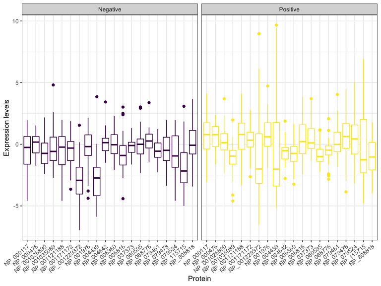
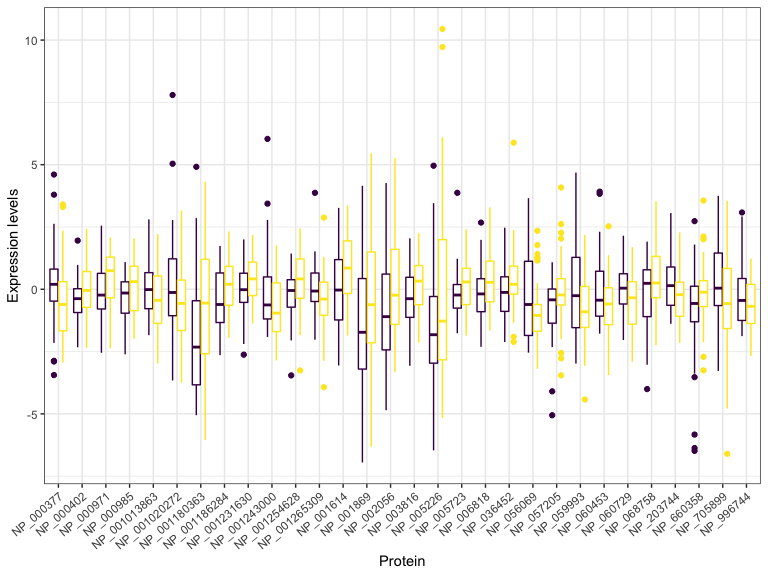

Breast Cancer Type Prediction using Proteomic Data
================
Ngoc Duong - nqd2000
05/15/2020

Import data and get rid of NA values

``` r
#import data
outcome = read.csv("./breastcancerproteomes/clinical_data_breast_cancer.csv") %>% janitor::clean_names()
proteome = read.csv("./breastcancerproteomes/77_cancer_proteomes_CPTAC_itraq.csv") 

#clean proteome data
#transpose dataset
proteome_tp <- transpose(proteome)

#get row and colnames in order
colnames(proteome_tp) <- proteome$RefSeq_accession_number
proteome_tp$par_id <- colnames(proteome) 

#rearrange data
proteome_with_id = as_tibble(proteome_tp) %>% select(par_id, everything()) %>% .[-c(1:3),] %>% separate(par_id, c("id2","id4","tcga")) %>% select(-tcga)

proteome_wo_id = as_tibble(proteome_tp) %>% select(-par_id, everything()) %>% .[-c(1:3),-ncol(proteome_tp)]
  
#clean outcome data 
outcome_clean = outcome %>% 
  separate(complete_tcga_id, c("tcga","id2","id4"), "-") %>% #sep id based on 2-digit id and 4-digit id
  select(-tcga) %>% 
  select(id2, id4, tumor) %>% drop_na(tumor)

bcp_merge = left_join(proteome_with_id, outcome_clean, by = c("id2","id4"))
```

Leave out proteins that have missing quantification values

``` r
missing.counts <- NULL
for(i in 1:ncol(proteome_wo_id)) {
missing.counts[i] <- sum(is.na(proteome_wo_id[,i]))}

miss <- names(proteome_wo_id)[which(missing.counts >= 1)] 

proteome_woid_nona = proteome_wo_id[ ,!(colnames(proteome_wo_id) %in% c(miss))]
```

Screening variables

``` r
#find variance for all proteins
var <- NULL
for(i in 1:ncol(proteome_woid_nona)){
var[i] <- var(proteome_woid_nona[,i])}

var_id = tibble(row = c(1:7994), var) %>% arrange(desc(var)) %>% slice(1:500)

#find names of proteins with high variances and put them in a vector
sup.var = names(proteome_woid_nona)[var_id$row]

#subset original data with the created vector
proteome_final = proteome_woid_nona[,c(sup.var)]
```

Obtain final data

``` r
#merge proteome and clinical data 
bcp_data = cbind(proteome_final, tumor = bcp_merge$tumor) %>% as_tibble() %>% drop_na(tumor) 
```

Exploratory data analysis

``` r
#grouped boxplots
bcp_eda_top = bcp_data %>% dplyr::select(c(1:20, 501)) %>% mutate_at(vars(-tumor), as.numeric)

bcp_eda_top %>% 
  pivot_longer(1:20,
               names_to = "protein",
               values_to = "value") %>% 
  group_by(tumor) %>% 
  ggplot(aes(x = protein, y = value, color = tumor)) +
  geom_boxplot() + theme_bw() + facet_grid(~tumor) + 
  theme(legend.position = "none",
        axis.title.x=element_blank(),
        axis.text.x = element_text(angle = 40, hjust = 1))
```



``` r
#mid 30 proteins
bcp_eda_mid = bcp_data %>% dplyr::select(c(241:270, 501)) %>% mutate_at(vars(-tumor), as.numeric)

bcp_eda_mid %>% 
  pivot_longer(1:30,
               names_to = "protein",
               values_to = "value") %>% 
  group_by(tumor) %>% 
  ggplot(aes(x = protein, y = value, color = tumor)) +
  geom_boxplot() + theme_bw() + 
  theme(legend.position = "none",
        axis.title.x=element_blank(),
        axis.text.x = element_text(angle = 40, hjust = 1))
```



``` r
#bottom 40 proteins
bcp_eda_bottom = bcp_data %>% dplyr::select(c(461:500, 501)) %>% mutate_at(vars(-tumor), as.numeric)

bcp_eda_bottom %>% 
  pivot_longer(1:40,
               names_to = "protein",
               values_to = "value") %>% 
  group_by(tumor) %>% 
  ggplot(aes(x = protein, y = value, color = tumor)) +
  geom_boxplot() + theme_bw() + 
  theme(legend.position = "none",
        axis.title.x=element_blank(),
        axis.text.x = element_text(angle = 40, hjust = 1))
```


