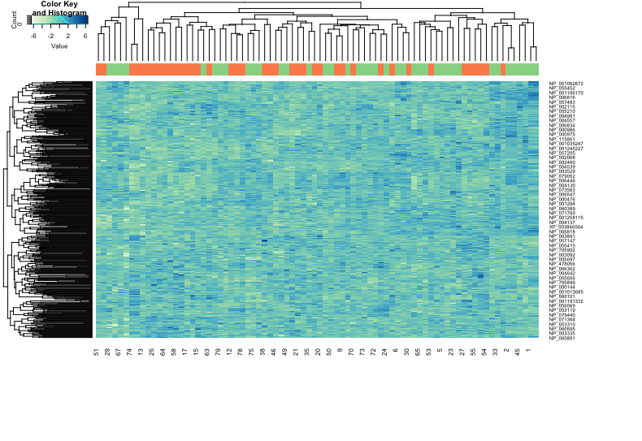
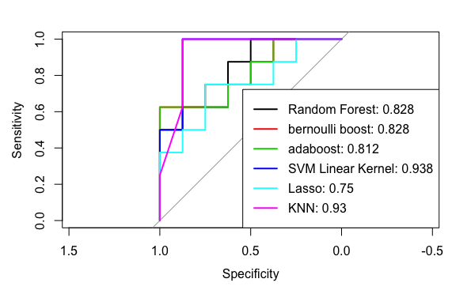
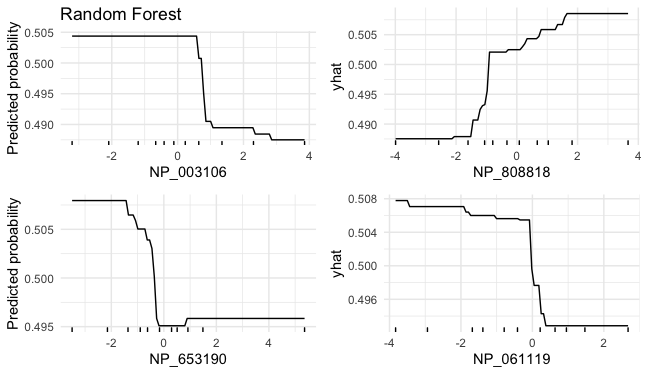
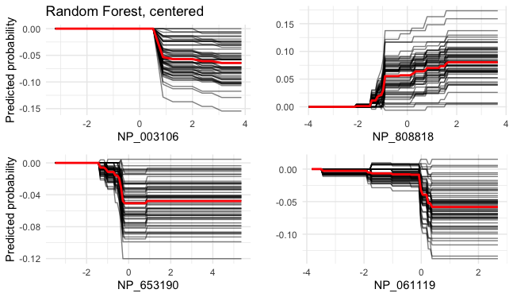
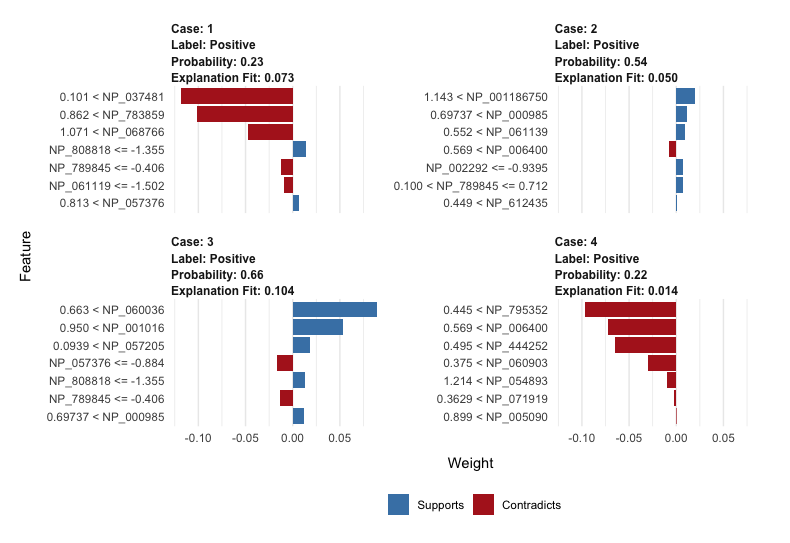
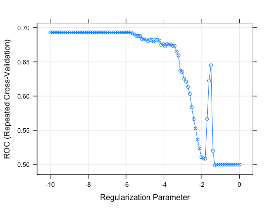
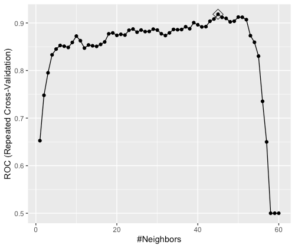

# Introduction
Lymph nodes are bodily organs that act as filters along the lymph fluid channels. In many cases of breast cancer metastasis, the spread of cancer cells often reach nearby lymph nodes or other further nodes. In other words, having cancer cells in the lymph nodes suggests an increased risk of the cancer metastasis. When lymph nodes are clear of cancer, the test results are negative, and similarly, lymph nodes with some cancer cells in them, they are called positive (American Cancer Society).

In this project, we aim to use proteomic data and classification tools in machine learning to identify proteins that play a key role in the involvement of cancer cells in lymph nodes and prognosis of breast cancer in general. The result might have implications in precision medicine, where medications can be made or modified on an individual/sub-group level to regulate expression levels of proteins preventive or contributive to the spread of cancer cells to lymph nodes.

# Data
The dataset we used contains iTRAQ proteome profiling of 80 breast cancer samples generated by the Clinical Proteomic Tumor Analysis Consortium (NCI/NIH). Predictor variables are expression levels of about 12,000 proteins. Our main clinical outcome is the status of lymph-node involvement -- "positive" for cancer having spread to lymph nodes, and "negative" for cancer-free lymph nodes. 

The data obtained was quite raw, with missing values present when a given protein could not be quantified for a certain subject. For the simplicity of this project, we decided to drop all proteins that have missing values in them, even though these missing values were likely not random. This leaves us with about 8,000 proteins, The next step in the variable screening process involves selecting 5,000 proteins with highest variances. Finally, we picked 500 proteins that were most associated with the outcome. Here, we used two-sample independent t-test to obtain a p-value for each protein, and then extracted 500 proteins with the lowest p-values as our final set of predictors. Before doing EDA and model building, we also scaled the data. 

# Exploratory Data Analysis

The heatmap (**Figure 1**) gives some preliminary observations. As green represents "positive" and orange represents "negative" outcome, we can see that upregulation of some proteins are observed in people with cancer-positive lymph nodes (dark blue cells). For example, these proteins include NP_004439, NP_808818, and NP_001028170. Similarly, down-regulation of some other proteins are observed in these same subjects (white cells), such as NP_004642, NP_0653190, NP_996744. 

However, heatmaps for data of this scale might not be easy to read. Therefore, we also applied k-means clustering on the optimal number of clusters (k = 7). From the k-means clustering plot **Figure 2**, we selected 4 most different clusters (cluster 3, 4, 6, and 7). We then looked at how the expression levels of the highest-variance 25 proteins differ between cancer status of lymph node (**Figure 3**). We could see cluster 4 has few people with cancer-negative lymph nodes. Cluster 6 and cluster 7 seem to have some interesting contrasts. Negative cases in cluster 7 tend to have lower expression levels of certain proteins while those in cluster 6 have higher levels of the same proteins. Cluster 3 and cluster 7 seem to also share the same relationship.
In the end, since we are only looking at the first 25 proteins, these observations do not give inclusive results, but closer looks could potentially give us the proteins that are important.


# Models
All models were tuned using repeated cross-validation with ROC as the metric.

## Logistic-LASSO

We used a $\lambda$ tuning grid from $e^{-10}$ to 1. The best model obtained occurred at a lambda value of 0.00315, which had the highest ROC among the different lambda values tested. However, when applied this tuned model to the evaluation set, the confusion matrix gave the test accuracy score of 68.75% and AUC of 0.75, indicating that the model is not great at classifying the subjects into positive or negative for lymph node cancer based on selected proteins.

We also noticed that the accuracy of the logistic-LASSO model could be unstable. Changing the seed caused the metric ROC to change quite a bit since given different values of selected $\lambda$. We suspect this is due to the high-dimensionality of the data and multicollinearity among some proteins.
   
## KNN

The KNN model was created with all the variables, and a range of 1 through 60 was chosen for the values of k, since the training dataset had 60 values. Using a graph of Accuracy vs. Number of Neighbors, we were able to determine that the model has the highest accuracy when k = 45, as highlighted in the plot of the model. When used to classify the patients into node-positive or node-negative, the model with 45 nearest neighbors gives a classification accuracy of 75%, as indicated in the confusion matrix. In addition, the AUC is 0.93, which is significantly higher than that of the logistic-LASSO model, indicating that the KNN model is better at classification.

**Caveats:** as observed, both logistic-LASSO and kNN’s performance could be affected by the high dimensionality of this dataset.

## Random Forest

Since decision trees suffer from the curse of dimensionality, we built a random forest, combining smaller, slow-learning trees to improve prediction and reduce variance by averaging the trees. To search for the best number of randomly selected predictors m, we set the tunegrid to be between 1 and 30. 

Although the square root of p is generally used as “mtry” for classification trees, we tuned over this range to ensure the model finds the optimal m value. The best model had m = 13, and minimal node size = 2, giving a cross-validated ROC of 0.94. Applying our random forest model on the test data, the confusion matrix shows that there is 68.75% accuracy in correctly predicting the node-status, better than the LASSO model. 

## Boosting

Then, we tried two boosting models, gradient descent with a binomial loss and AdaBoost. Trees of 1000, 2000, and 3000, an interaction depth ranging from 1 to 4, shrinkage values of 0.001, 0.003, 0.005, and 0.01, and minimum number of observations for each terminal node was allowed to range from 1 to 5. 

The tuned GBM with binomial loss used 1000 trees, whose depth was 4, shrinkage of 0.01, and a minimum number of observations for each terminal node of 1. This resulted in a CV ROC of 0.906, and a 68.75% test accuracy. For AdaBoosting, the tuned model used 2000 trees, whose depth was 4, shrinkage of 0.01, and a minimum number of observations for each terminal node of 1. This resulted in a CV ROC of 0.917, and similar test performance at 68.75% accuracy.

**Caveats:** Boosting required more care to tune and we were not able to obtain one with better performance than the random forest. 

## Support vector classifier/machines

Since p > n, we decided that a linear kernel should be sufficient to find hyperplanes that separate the two classes well, while also robust to the caveat of high dimensionality. On the other hand, solving the radial kernel of SVM could take more time and be prone to overfitting. 

The goal of SVC is to find a hyperplane in 500 dimensions that is also a maximal margin classifier, which makes the hyperplane itself as insensitive to the changes in data as possible. Since we are using the linear kernel, we only have one hyperparameter, which is the cost parameter C. The best tuned model gave CV ROC of 95.6% using C = 0.001. This model also gave a test prediction accuracy of 68.75%.

Although the test performance for RF did approximately the same as the boosting models and did better than LASSO and kNN, it did not perform as well as SVM’s test performance. However, RF had a 100% training test accuracy compared to SVM’s 92% training test accuracy. The test AUC for all models considered can be found in **Figure 4**.

## Final Model

Although SVC and RF have very similar performance (both on CV ROC and test accuracy), we decided to go with the RF model for interpretation purposes (we have not had time to explore how to get varImp/most important support vectors on SVM). 

## Visualizations and interpretations of black-box models

After selecting the final model, we are interested in learning more about the most influential proteins in this model. We used function **varImp** to identify 75 most impactful proteins (using the selected Random Forest model) and used hierarchical clustering to get some information about the physiological functions and group memberships of these proteins. In the dendrogram (**Figure 5**), we decided to go with 9 clusters in order to get more similarities between proteins within the clusters. Ideally, in the absence of time and effort constraint, we would have tried increasing the number of clusters, thereby reducing height, to obtain better-defined protein groups.

First, we want to explore the marginal impact of some particular proteins on the predicted probability of lymph-node involvement across all observations. We extracted the 4 most important proteins (NP_003106, NP_808818, NP_653190, NP_061119), and created Partial Dependence Plots (PDPs).

### PDP

From **Figure 6**, we can see that higher expressions of proteins NP_003106, NP_653190, and NP_061119 are associated with lowered predicted probability of lymph-node involvement, on average. Meanwhile, upregulation of protein NP_808818 is related to higher expected risk of
lymph-node involvement, on average. Specically, some external research shows that NP_808818 (armadillo repeat-containing X-linked protein 2) containing arm repeats are involved in development, maintenance of tissue integrity, and production and formation of tumors. On the other hand NP_003106 is protective against inhibitors of N-linked glycosylation, which is associated with cancers; and NP_653190 has been shown to be associated with breast size also influence breast cancer risk. (**Source:** NCBI/NIH: Proteins)

### ICE 

While PDP shows the average effect of a feature on the response at a global scale, we could also focus on specific individual instances using the (centered) individual conditional expectation (ICE) plot (**Figure 7**). Each ICE line demonstrates one subject, which displays how the predicted probability of lymph node cancer spread changes as a protein expression level changes for that one subject. The centered ICE plots demonstrate quite similar interpretations to those of the PDPs. For instance, we identify an sharp increase in predicted risk as expression value of NP_808818 approaches -1, followed by a flatter increase in predicted risk once the protein is up-regulated from around 0 to 4. Furthermore, we see a couple turbulent regions between -2 and -1 and 0 and 2, but the overall trend is not affected much.

### LIME

Although PDP and ICE curves were helpful in showing the patterns of influence of certain proteins on the response, they do not give insights into the impact of these variables when we make predictions on new observations. Therefore, we also used local Interpretable Model-agnostic Explanations (LIME) to see which proteins are important in explaining individual predictions and what their impacts are in these predictions.

LIME assumes linearity on a local scale (around any particular observation) for every complicated model. The visualization works by fitting a simple model (e.g., regression) on the permuted data (values change slightly) in the locality to mimic how the global model behaves at that locality. Specifically, looking at **Figure 8**, for case 1, we noticed that upregulation of NP_037481, NP_783859, and NP_068766 has a negative effect on the expected risk of lymph-node involvement. These proteins carried the most weight in deciding outcome for the first case, but were not among the top 4 proteins explored above. Globally influential proteins NP_808818, NP_653190, NP_061119 were still among the most important in making predictions for cases 1-3. Their impacts on the predicted risk are in accordance with the global interpretations above.


## Limitations

The small sample size (n = 80) and high number of predictors (p = 500) produced some challenges for some models (such as regularized logistic regression or kNN). PCA could have been used for dimension-reduction pre-model training; however, the goal of interpreting our results on a protein-specific level diverted us from doing so. 

GBM and ADAboost likely would have performed better provided more computational power and time put in tuning the hyperparameters.

Leaving out proteins that had missing values instead of imputing might have caused more bias in the prediction results. However, for this particular problem, choosing among different imputation methods is another question to investigate. This is a caveat in this project that leaves much room to improve.

# Conclusion

Although we decided to go with the random forest model due to interpretation purposes, support vector classifier could have been a better choice if prediction is the ultimate goal. In this respect, the support vector classifier could be better than Random Forest due to faster computation, fewer hyperparamaters to tune, and equally good, if not better, discriminatory power. However, since the main function of SVC is to construct hyperplanes, we cannot obtain predict the risk of cancer-positive lymph node in breast cancer patients like in logistic-LASSO or tree-based methods. Although finding important variables from SVC model and interpreting it using PDP or LIME is feasible, we decided not to do so in this report. That said, exploring this option could be an interesting next step as it might yield more insights into, or confirm the role of certain proteins in predicting risk of breast cancer metastasis to lymph nodes. In the end, many proteins suggested by our models have not been researched with regard to their potential link to breast cancer metastasis before, so this could be the first step in exploring more of their functions in our body. 

# Reference:

* American Cancer Society https://www.cancer.org/cancer/breast-cancer/treatment/surgery-for-breast-cancer/lymph-node-surgery-for-breast-cancer.html

* James, G., Witten, D., Hastie, T., Tibshirani, R., "Introduction to Statistical Learning in R."

* NCBI/NIH: Proteins. Accessed at: https://www.ncbi.nlm.nih.gov/protein/

\pagebreak

\newpage

## Plots 

```{r fig.cap="Heatmap of data", out.width = '110%', echo = FALSE}

```

```{r fig.cap="K-means clustering of 80 subjects when k = 7", out.width = '100%', echo = FALSE}
knitr::include_graphics("k-means.Rplot.png")
```

```{r fig.cap="Grouped boxplots of protein expressions for first 25 proteins stratified by cluster", out.width = '110%', echo = FALSE}
knitr::include_graphics("kmeans-boxplots.Rplot.png")
```

\pagebreak

\newpage

```{r fig.cap="ROC curves on evaluation set", out.width = '100%', echo = FALSE}

```

```{r fig.cap="Dendorgram from hierarchical clustering of 75 most important proteins from Random Forest model", out.width = '100%', echo = FALSE}
knitr::include_graphics("Rplot01.png")
```

```{r fig.cap="Partial Depdendence Plots of first 4 most important proteins from Random Forest model", out.width = '100%', echo = FALSE}

```

```{r fig.cap= "Individual Conditional Expectation curves from Random Forest model", out.width = '100%', echo = FALSE}

```

```{r fig.cap= "LIME graphs for subject 1, 3, 4, and 7 (randomly chosen)", out.width = '120%', echo = FALSE}

```

\pagebreak

\newpage


# APPENDIX

**Protein clusters**
We want to provide more details about the 75 most important proteins that we selected and how they are related here. **Source: NCBI/NIH: Proteins**

**Cluster 1: Muscular Diseases**

NP_003119: Spectrin Beta Chain, non-erythrocytic 1 isoform 1

NP_004005: Dystrophin Isoform, associated with muscular dystrophy

NP_057381: Prenylcysteine oxidase 1 precursor, associated with cardiovascular disease

NP_001177925: Actin-Related protein 2/3 complex subunit, part of an aging mechanism

**Cluster 2: Associated with High Risk Diseases**

NP_945187: Dihydro-oxoguanine Triphosphate Isoform, Potential indicator of patients with oral squamous cell carcinoma (could be an indicator of lymph node cancer)

NP_060104: BTB/POZ domain-containing protein KCTD9, indication of viral hepatitis B

NP_035463: C-C motif chemokine 2 precursus, contributes to neuropathic pain

NP_078867: Charged multivesicular body protein 6, leads to cell death when paired with ESCRT II

**Cluster 3: Associated with High Risk Diseases**

NP_003891: Sequestosome Isoform 1, promotes bladder cancer cell growth

NP_005882: Acetyl-CoA acetyltransferase, associated with increased risk of coronary artery disease

NP_006023: Copine-6 isoform 2, may selectively suppress neurotransmission

**Cluster 4: Promoted Cancer Cell Proliferation & Blood Glucose Levels and Insulin**

NP_872407: pleckstrin homology domain-containing family S member 1 isoform 1, involved in mild elevation of blood glucose levels and insulin resistance in obesity

NP_061139: tRNA (guanine-N(7)-)-methyltransferase non-catalytic subunit WDR4 isoform 1, involved in the mild elevation of blood glucose levels and insulin resistance in obesity

NP_001229372: growth factor receptor-bound protein 7 isoform a, promotion of breast/ovarian cancer

NP_064695: aldo-keto reductase family 1 member B10, promotes cancer cells/tumors (lung, breast)

**Cluster 5: Stress DNA response**

NP_005582: double-strand break repair protein MRE11 isoform 1, DNA damage response markers

NP_937886: ankyrin repeat and SOCS box protein 7 isoform 2, stress responsive gene

NP_003106: UDP-N-acetylhexosamine pyrophosphorylase isoform a, overexpressed in prostate cancer and protects cancer cells from endoplasmic reticulum stress, conferring growth advantage

**Cluster 6: Associated with increased Breast Cancer Risk via genetic variants**

NP_001073899: TOX high mobility group box family member 3 isoform 1, associated with increased breast cancer risk

NP_057149: 28S ribosomal protein S16, mitochondrial, genetic variants in mitochondrial genes

NP_001243635: anaphase-promoting complex subunit 10 isoform 1, related to anaphase

NP_060108: mediator of RNA polymerase II transcription subunit 18, transcription activation

**Cluster 7: cell proliferation function**

NP_079524: SRC kinase signaling inhibitor 1, exerts oncogenic functions, facilitate cell proliferation and invasion

NP_006370 semaphorin-3C isoform 2 precursor secreted glycoprotein that belongs to a family of neuronal guidance cues, correlates with an increase in cancer cell invasion and adhesion.

NP_653190: catechol O-methyltransferase domain-containing protein 1, is associated with breast size, and also influences breast cancer risk

NP_055577: delta(24)-sterol reductase precursor, overexpression has been observed in adrenal gland cancer cells.

**Cluster 8: cellular signaling and growth**

NP_003092: sterol O-acyltransferase 1 isoform 1, implicated in the formation of beta-amyloid and atherosclerotic plaques; role in ovarian cancer progression

NP_006818: transmembrane emp24 domain-containing protein 10 precursor, is associated with breast cancer, modulates cell growth in papillary thyroid cancer cells by inducing autophagy

NP_006246: protein kinase C eta type, belongs to family of serine- and threonine-specific protein kinases, serve as major receptors for phorbol esters, a class of tumor promoters.

**Cluster 9: mitochondrial function**

NP_789842 — inorganic pyrophosphatase 2, mitochondrial isoform 3 precursor — localized to the mitochondrion — catalyze hydrolysis of pyrophosphate to inorganic phosphate, which is important for the phosphate metabolism of cells.

NP_001853 — cytochrome c oxidase subunit 5B, mitochondrial precursor — the terminal enzyme of the mitochondrial respiratory chain, catalyzes electron transfer and proton pumping activities, also plays a role in the regulation and assembly of the complex.

NP_001856 — cytochrome c oxidase subunit 7A2, mitochondrial isoform a precursor — same function as NP_001853

NP_004709 — cytochrome c oxidase subunit 7A-related protein, mitochondrial isoform a —  the terminal component of the mitochondrial respiratory chain, is upregulated in breast cancer cell line after estrogen treatment.

\pagebreak

\newpage

### CV performance plots

```{r fig.cap= "Model tuning plot for logistic-LASSO", out.width = '100%', echo = FALSE}

```

```{r fig.cap= "Model tuning plot for kNN", out.width = '100%', echo = FALSE}

```

```{r fig.cap= "Model tuning plot for Random Forest", out.width = '100%', echo = FALSE}
knitr::include_graphics("rf_tuning copy.png")
```

```{r fig.cap= "Model tuning plot for GBM", out.width = '100%', echo = FALSE}
knitr::include_graphics("Bernoulli_boosting_tuning copy.png")
```

```{r fig.cap= "Model tuning plot for ADABoost", out.width = '100%', echo = FALSE}
knitr::include_graphics("AdaBoosting_tuning copy.png")
```

```{r fig.cap= "Model tuning plot for SVC", out.width = '100%', echo = FALSE}
knitr::include_graphics("SVC.Rplot.png")
```


