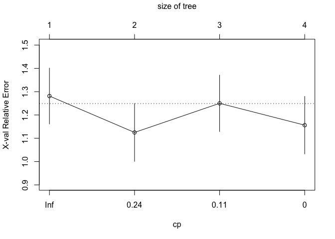
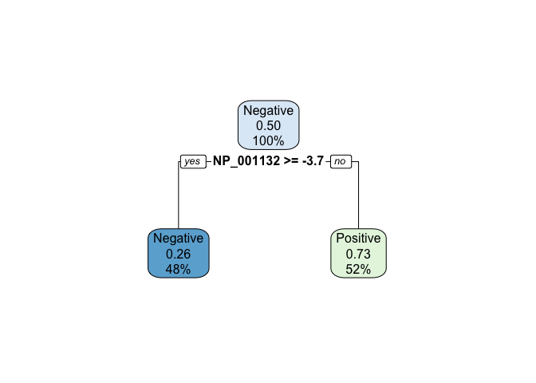
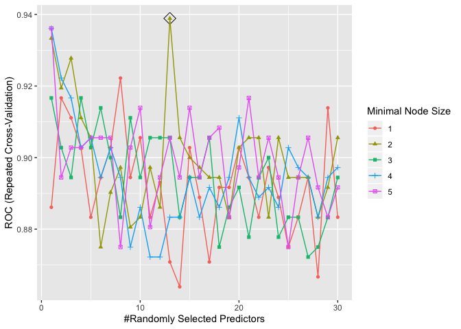
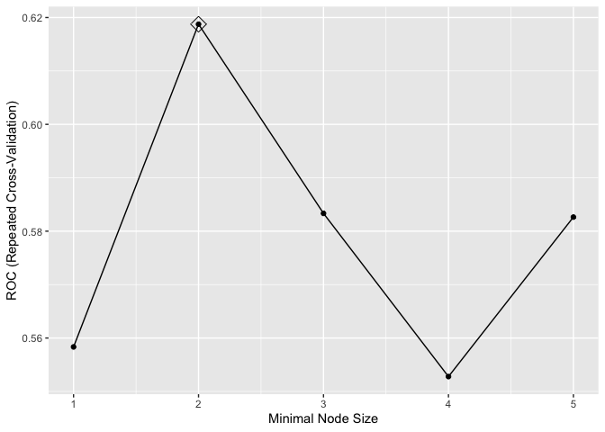
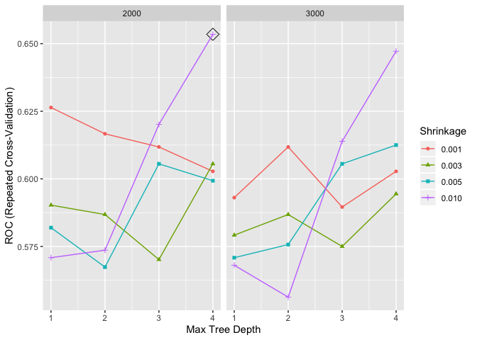
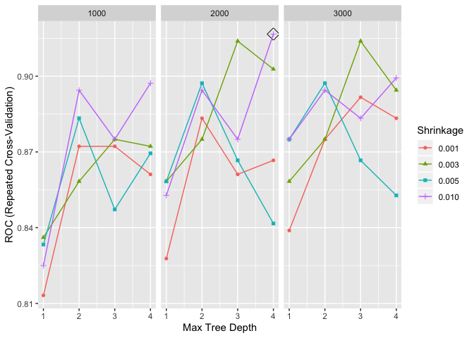
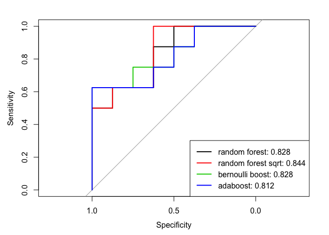

stl2137\_trees
================

``` r
load("./final_data.RData")

set.seed(13)
rowTrain <-createDataPartition(y = bcp_data$node,
                               p = 0.80,
                               list = FALSE)
bcp_train = bcp_data[rowTrain,]
bcp_test = bcp_data[-rowTrain,]
```

## Classification Trees

``` r
set.seed(13)
tree1 <- rpart(formula = node ~., data = bcp_train,
               control = rpart.control(cp = 0))

cpTable <- printcp(tree1)
```

    ## 
    ## Classification tree:
    ## rpart(formula = node ~ ., data = bcp_train, control = rpart.control(cp = 0))
    ## 
    ## Variables actually used in tree construction:
    ## [1] NP_000476 NP_055410 NP_060595
    ## 
    ## Root node error: 32/64 = 0.5
    ## 
    ## n= 64 
    ## 
    ##        CP nsplit rel error xerror    xstd
    ## 1 0.43750      0   1.00000 1.2812 0.11995
    ## 2 0.21875      1   0.56250 1.3750 0.11588
    ## 3 0.03125      2   0.34375 1.1562 0.12346
    ## 4 0.00000      3   0.31250 1.0625 0.12476

``` r
plotcp(tree1)
```

<!-- -->

``` r
minErr <- which.min(cpTable[,4])

tree2 <- prune(tree1, cp = cpTable[minErr,1])
rpart.plot(tree2)
```

<!-- -->

## Random Forest

``` r
control <- trainControl(method = "repeatedcv",
                     summaryFunction = twoClassSummary,
                     classProbs = TRUE)
```

### Using Square Root Range

``` r
rf_grid <- expand.grid(mtry = 1:30,
                       splitrule = "gini",
                       min.node.size = 1:5)

set.seed(13)
rf_fit <- train(node ~., bcp_train,
                method = "ranger",
                tuneGrid = rf_grid,
                metric = "ROC",
                trControl = control)

ggplot(rf_fit, highlight = TRUE)
```

<!-- -->

### Using Exact Square Root

``` r
rf_grid_sqrt <- expand.grid(mtry = sqrt(ncol(bcp_data)),
                       splitrule = "gini",
                       min.node.size = 1:5)

set.seed(13)
rf_fit_sqrt <- train(node ~., bcp_train,
                method = "ranger",
                tuneGrid = rf_grid_sqrt,
                metric = "ROC",
                trControl = control)

ggplot(rf_fit_sqrt, highlight = TRUE)
```

<!-- -->

## Random Forest Test Prediction & Error

``` r
### 1:30 Range
rf_pred <- predict(rf_fit, newdata = bcp_test, type = "prob")
rf_pred_test_error <- ifelse(rf_pred$Negative > 0.5, "Negative", "Positive")
table(rf_pred_test_error, bcp_test$node)
```

    ##                   
    ## rf_pred_test_error Negative Positive
    ##           Negative        7        4
    ##           Positive        1        4

``` r
### Square Root 
rf_pred_sqrt <- predict(rf_fit_sqrt, newdata = bcp_test, type = "prob")
rf_pred_sqrt_test_error <- ifelse(rf_pred_sqrt$Negative > 0.5, "Negative", "Positive")
table(rf_pred_sqrt_test_error, bcp_test$node)
```

    ##                        
    ## rf_pred_sqrt_test_error Negative Positive
    ##                Negative        8        5
    ##                Positive        0        3

## Boosting

### Distribution = Bernoulli

``` r
bern_boosting_grid <- expand.grid(n.trees = c(1000, 2000,3000),
                        interaction.depth = 1:4,
                        shrinkage = c(0.001, 0.003, 0.005, 0.01),
                        n.minobsinnode = 1)

set.seed(13)
# Binomial loss function
bern_boosting_fit <- train(node~., bcp_train, 
                 tuneGrid = bern_boosting_grid,
                 trControl = control,
                 method = "gbm",
                 distribution = "bernoulli",
                 metric = "ROC",
                 verbose = FALSE)

ggplot(bern_boosting_fit, highlight = TRUE)
```

<!-- -->

``` r
bern_boosting_pred <- predict(bern_boosting_fit, newdata = bcp_test, type = "prob")
bern_boosting_test_error <- ifelse(bern_boosting_pred$Negative > 0.5, "Negative", "Positive")
table(bern_boosting_test_error, bcp_test$node)
```

    ##                         
    ## bern_boosting_test_error Negative Positive
    ##                 Negative        8        5
    ##                 Positive        0        3

### AdaBoosting

``` r
adaboosting_grid <- expand.grid(n.trees = c(1000, 2000,3000),
                        interaction.depth = 1:4,
                        shrinkage = c(0.001, 0.003, 0.005, 0.01),
                        n.minobsinnode = 1)
set.seed(13)
# Adaboost loss function
adaboosting_fit <- train(node ~., bcp_train, 
                 tuneGrid = adaboosting_grid,
                 trControl = control,
                 method = "gbm",
                 distribution = "adaboost",
                 metric = "ROC",
                 verbose = FALSE)

ggplot(adaboosting_fit, highlight = TRUE)
```

<!-- -->

``` r
adaboosting_pred <- predict(adaboosting_fit, newdata = bcp_test, type = "prob")
adaboosting_test_error <- ifelse(adaboosting_pred$Negative > 0.5, "Negative", "Positive")
table(adaboosting_test_error, bcp_test$node)
```

    ##                       
    ## adaboosting_test_error Negative Positive
    ##               Negative        8        5
    ##               Positive        0        3

# Test Data Performance

``` r
roc_rf <- roc(bcp_test$node, rf_pred[,1])
```

    ## Setting levels: control = Negative, case = Positive

    ## Setting direction: controls > cases

``` r
roc_rf_sqrt <- roc(bcp_test$node, rf_pred_sqrt[,1])
```

    ## Setting levels: control = Negative, case = Positive
    ## Setting direction: controls > cases

``` r
roc_bern_boost <- roc(bcp_test$node, bern_boosting_pred[,1])
```

    ## Setting levels: control = Negative, case = Positive
    ## Setting direction: controls > cases

``` r
roc_adaboost <- roc(bcp_test$node, adaboosting_pred[,1])
```

    ## Setting levels: control = Negative, case = Positive
    ## Setting direction: controls > cases

``` r
plot(roc_rf)
plot(roc_rf_sqrt, add = TRUE, col = 2)
plot(roc_bern_boost, add = TRUE, col = 3)
plot(roc_adaboost, add = TRUE, col = 4)

auc <- c(roc_rf$auc[1], roc_rf_sqrt$auc[1], roc_bern_boost$auc[1], roc_adaboost$auc[1])


modelNames <- c("random forest","random forest sqrt","bernoulli boost","adaboost")
legend("bottomright", legend = paste0(modelNames, ": ", round(auc,3)),
       col = 1:6, lwd = 2)
```

<!-- -->
